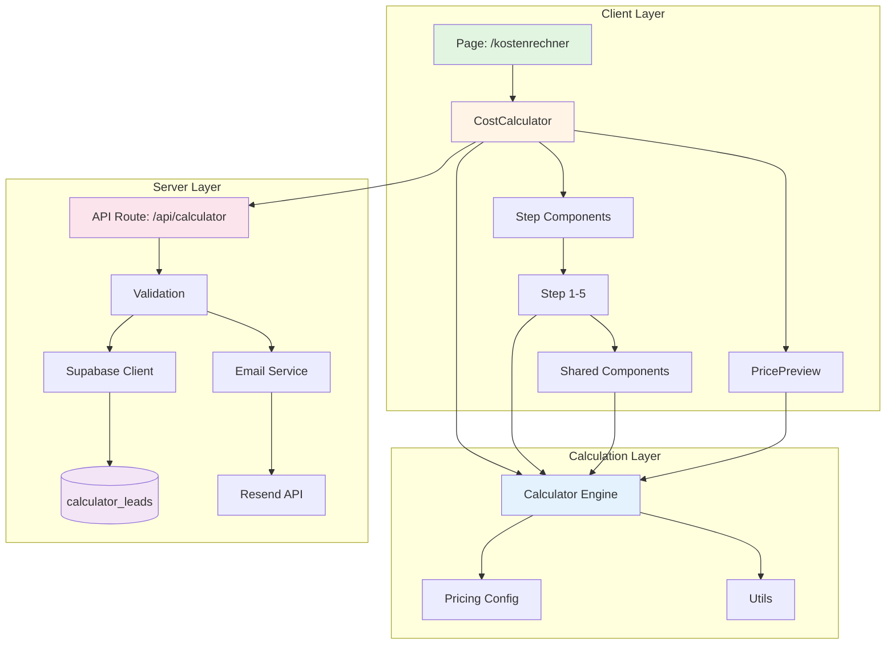
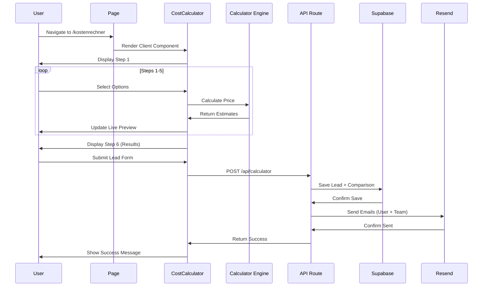
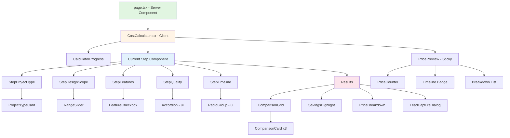

# Design Document: Kostenrechner

## Overview

Der **Kostenrechner** ist ein interaktiver, 6-stufiger Wizard, der potentiellen Kunden eine transparente Kostenschätzung für Website-, App- und E-Commerce-Projekte bietet. Das Feature kombiniert eine intuitive Multi-Step-Form mit einer intelligenten Berechnungs-Engine und einem **3-Wege-Preisvergleich** (Freelancer vs. Agentur vs. HEADON).

**System-Integration:**
- **Routes**: Multi-Landing-Page-Strategie für SEO-Optimierung
  - Hauptseite: `/webseite-erstellen-lassen-kosten` (Primary High-Volume Keyword)
  - Alternative Pages: `/homepage-kosten`, `/webdesigner-preise`, `/website-kosten`
  - Legacy Redirect: `/kostenrechner` → 301 Redirect zu Hauptseite
- **Components**: 20+ neue Components in `components/calculator/`
- **Backend**: Neue API Route `/api/calculator` + Supabase Integration
- **Analytics**: Umami Event-Tracking für Conversion-Funnel

**Tech Stack:**
- Next.js 15 (App Router) mit React 19
- TypeScript (Strict Mode)
- Tailwind CSS v4 + shadcn/ui
- Framer Motion für Animationen
- Zod für Validation
- Supabase für Lead-Storage
- Resend API für Email-Notifications

**Key Design Principles:**
1. **Performance-First**: SSG für Entry Page, Client-Only für Calculator State
2. **Mobile-Optimized**: Touch-friendly, responsive Layouts
3. **Accessibility**: WCAG AA konform (Keyboard Navigation, Screen Reader)
4. **Modular Architecture**: Separierte Step Components, wiederverwendbare Utilities

---

## Steering Document Alignment

### Technical Standards (tech.md)

#### Framework Alignment
- **Next.js 15 App Router**: Folgt Projekt-Standard für alle neuen Features
- **React Server Components**: Entry Page als Server Component, Calculator als Client Component
- **TypeScript Strict Mode**: Alle Components mit expliziten Types
- **pnpm**: Package Manager wie projektübergreifend definiert

#### Component Architecture
- **shadcn/ui Components**: Bestehende UI-Primitives werden wiederverwendet (Button, Input, Label, Select, Accordion, Dialog, Tabs)
- **Neue Components hinzufügen**: `checkbox`, `radio-group`, `slider`, `progress`, `switch`, `tooltip`
- **Framer Motion**: Animation-Bibliothek bereits im Projekt (wie MultiStepForm)
- **Class Variance Authority**: Für Comp Variants wie im Projekt etabliert

#### Backend Integration
- **Supabase PostgreSQL**: Nutzt bestehende Supabase-Infrastruktur (siehe `lib/supabase.ts`)
- **Resend API**: Nutzt bestehende Email-Integration (Pattern aus `/api/contact`)
- **API Route Pattern**: Folgt Next.js API Route Conventions mit Zod Validation

#### Validation & Type Safety
- **Zod Schemas**: Wie in `lib/validations.ts` und `lib/content/frontmatter.ts`
- **Runtime Validation**: Client + Server-Side Validation
- **Type Inference**: TypeScript Types aus Zod Schemas ableiten

#### Performance Standards
- **LCP < 1.5s**: Erfüllt Core Web Vitals Requirements
- **Code Splitting**: React.lazy für Step Components
- **Debounced Updates**: Live Preview mit 300ms Debounce
- **Static Generation**: Entry Page pre-rendered

### Project Structure (structure.md)

#### File Organization

```
app/
├── webseite-erstellen-lassen-kosten/  # Primary Landing Page (High-Volume Keyword)
│   ├── page.tsx                       # Server Component (SEO + Calculator)
│   └── metadata.ts                    # SEO Metadata (Main Keyword)
│
├── homepage-kosten/                   # Alternative Landing Page
│   ├── page.tsx                       # Server Component (Alternative Copy)
│   └── metadata.ts                    # SEO Metadata (Alternative Keyword)
│
├── webdesigner-preise/                # Dienstleister-fokussiert
│   ├── page.tsx                       # Server Component (Provider Focus)
│   └── metadata.ts                    # SEO Metadata (Provider Keyword)
│
├── website-kosten/                    # EN/DE Mixed Keyword
│   ├── page.tsx                       # Server Component (Mixed Variant)
│   └── metadata.ts                    # SEO Metadata (Mixed Keyword)
│
└── kostenrechner/                     # Legacy Route (301 Redirect)
    └── page.tsx                       # Redirect Component

components/calculator/
├── CostCalculator.tsx          # Main Client Component (State Container)
├── CalculatorProgress.tsx      # Progress Bar (1/6, 2/6, ...)
├── PricePreview.tsx            # Sticky Sidebar (Live Preview)
│
├── steps/
│   ├── StepProjectType.tsx     # Step 1
│   ├── StepDesignScope.tsx     # Step 2
│   ├── StepFeatures.tsx        # Step 3
│   ├── StepQuality.tsx         # Step 4
│   ├── StepTimeline.tsx        # Step 5
│   └── index.ts                # Barrel export
│
├── results/
│   ├── ComparisonGrid.tsx      # 3-Column Layout
│   ├── ComparisonCard.tsx      # Single Provider Card
│   ├── SavingsHighlight.tsx    # Savings Badge
│   ├── PriceBreakdown.tsx      # Detailed Breakdown
│   ├── LeadCaptureDialog.tsx   # Lead Form
│   └── index.ts                # Barrel export
│
└── shared/
    ├── ProjectTypeCard.tsx     # Icon Card Component
    ├── FeatureCheckbox.tsx     # Checkbox with Price Badge
    ├── RangeSlider.tsx         # Custom Range Input
    ├── PriceCounter.tsx        # Animated Number Counter
    └── index.ts                # Barrel export

lib/calculator/
├── types.ts                    # TypeScript Interfaces
├── pricing-config.ts           # Pricing Definitions & Factors
├── calculator-engine.ts        # Calculation Logic (3 Providers)
├── validation-schemas.ts       # Zod Schemas
└── utils.ts                    # Helper Functions

app/api/calculator/
└── route.ts                    # POST: Lead speichern + Email

lib/
└── email-templates.ts          # + createCalculatorResultEmail()
```

#### Naming Conventions
- **Components**: PascalCase (`CostCalculator.tsx`, `StepProjectType.tsx`)
- **Utilities**: camelCase (`pricing-config.ts`, `calculator-engine.ts`)
- **Types**: PascalCase Interfaces (`CalculatorState`, `ComparisonResult`)
- **Constants**: SCREAMING_SNAKE_CASE für exports (`BASE_PRICES`, `DESIGN_MULTIPLIERS`)

#### Import Patterns
- **Absolute Imports**: `@/components/calculator/*`, `@/lib/calculator/*`
- **No Relative Paths**: Außer co-located files (z.B. `./metadata.ts`)
- **Barrel Exports**: `steps/index.ts`, `results/index.ts` für cleane Imports

---

## SEO-Strategie: Multi-Landing-Page-Approach

### Keyword-Research Insights

**Problem**: "Kostenrechner" hat niedriges Suchvolumen (~100/Monat)
**Lösung**: Intent-basierte High-Volume Keywords (~1.500-3.000/Monat kombiniert)

### Target Keywords & Landing Pages

| Landing Page Route | Primary Keyword | Search Volume | Search Intent |
|-------------------|-----------------|---------------|---------------|
| `/webseite-erstellen-lassen-kosten` | webseite erstellen lassen kosten | **Hoch** ⭐ | Informational + Transactional |
| `/homepage-kosten` | homepage kosten, kosten homepage | Mittel | Direct Cost Query |
| `/webdesigner-preise` | webdesigner preise, webdesign kosten | Mittel | Provider-focused |
| `/website-kosten` | website kosten, website erstellen kosten | Mittel | EN/DE Mixed Variant |

### Landing Page Content Strategy

Jede Landing Page folgt dieser Struktur:

```
┌─────────────────────────────────────────────┐
│  H1 (Keyword-optimiert)                     │
│  "Webseite erstellen lassen - Kosten 2025" │
├─────────────────────────────────────────────┤
│  Trust Badges (500+ Projekte, ⌀4.9★)       │
├─────────────────────────────────────────────┤
│  < CostCalculator /> Component             │
│  (Identisch auf allen Pages)               │
├─────────────────────────────────────────────┤
│  Unique Content Section                     │
│  - Keyword-spezifische Erklärung           │
│  - Warum Preise variieren                  │
│  - Was beeinflusst Kosten                  │
├─────────────────────────────────────────────┤
│  FAQ Section (Keyword-optimiert)           │
│  - 5-8 Fragen pro Page                     │
│  - Unterschiedlich je nach Keyword         │
└─────────────────────────────────────────────┘
```

### Meta-Tags per Landing Page

#### 1. `/webseite-erstellen-lassen-kosten/metadata.ts`
```typescript
export const metadata: Metadata = {
  title: 'Webseite erstellen lassen - Kosten & Preise 2025 | HEADON.pro',
  description: 'Was kostet eine professionelle Webseite? Transparent kalkulieren in 2 Min. ✓ Vergleich: Freelancer vs. Agentur ✓ Alle Kosten im Überblick ✓ Unverbindlich',
  keywords: [
    'webseite erstellen lassen kosten',
    'webseite erstellen lassen preis',
    'was kostet eine webseite',
    'kosten website erstellen lassen',
    'webseite kosten',
  ],
  openGraph: {
    title: 'Webseite erstellen lassen - Was kostet es wirklich?',
    description: 'Transparent kalkulieren: Vergleichen Sie Freelancer, Agentur & HEADON-Preise in 2 Minuten.',
    url: 'https://headon.pro/webseite-erstellen-lassen-kosten',
    images: [{ url: '/og/calculator-main.png', width: 1200, height: 630 }],
  },
  alternates: {
    canonical: 'https://headon.pro/webseite-erstellen-lassen-kosten',
  },
}
```

#### 2. `/homepage-kosten/metadata.ts`
```typescript
export const metadata: Metadata = {
  title: 'Homepage Kosten Rechner 2025 - Was kostet eine Homepage? | HEADON',
  description: 'Homepage Kosten transparent berechnen ✓ Preisvergleich Freelancer vs Agentur ✓ Alle Faktoren im Überblick ✓ In 2 Minuten kalkuliert',
  keywords: [
    'homepage kosten',
    'kosten homepage',
    'was kostet eine homepage',
    'homepage erstellen kosten',
    'homepage preis',
  ],
  openGraph: {
    title: 'Homepage Kosten Rechner - Transparent & Fair',
    description: 'Berechnen Sie die Kosten für Ihre Homepage in 2 Minuten. Vergleichen Sie Anbieter.',
    url: 'https://headon.pro/homepage-kosten',
  },
  alternates: {
    canonical: 'https://headon.pro/homepage-kosten',
  },
}
```

#### 3. `/webdesigner-preise/metadata.ts`
```typescript
export const metadata: Metadata = {
  title: 'Webdesigner Preise 2025 - Was kosten Webdesign-Dienstleistungen?',
  description: 'Webdesigner Preise vergleichen ✓ Freelancer vs Agentur Kosten ✓ Transparenter Preisrechner ✓ Fair kalkuliert in 2 Minuten',
  keywords: [
    'webdesigner preise',
    'webdesign kosten',
    'was kostet ein webdesigner',
    'webdesigner stundensatz',
    'webdesign preise',
  ],
  openGraph: {
    title: 'Webdesigner Preise - Transparent vergleichen',
    description: 'Vergleichen Sie Webdesigner-Preise: Freelancer, Agentur & HEADON im direkten Vergleich.',
    url: 'https://headon.pro/webdesigner-preise',
  },
  alternates: {
    canonical: 'https://headon.pro/webdesigner-preise',
  },
}
```

#### 4. `/website-kosten/metadata.ts`
```typescript
export const metadata: Metadata = {
  title: 'Website Kosten Rechner 2025 - Was kostet eine Website?',
  description: 'Website Kosten transparent kalkulieren ✓ Alle Faktoren berücksichtigt ✓ Freelancer vs Agentur Vergleich ✓ Unverbindlich & kostenlos',
  keywords: [
    'website kosten',
    'kosten website',
    'was kostet eine website',
    'website erstellen kosten',
    'website preis',
  ],
  openGraph: {
    title: 'Website Kosten - Transparenter Preisrechner',
    description: 'Berechnen Sie Website-Kosten in 2 Minuten. Vergleichen Sie Anbieter & Preise.',
    url: 'https://headon.pro/website-kosten',
  },
  alternates: {
    canonical: 'https://headon.pro/website-kosten',
  },
}
```

### Duplicate Content Prevention

**Problem**: Gleicher Calculator auf mehreren Pages → Duplicate Content Risk?

**Lösung - Unique Content per Page:**
1. **Unique H1 & Hero-Text**: Jede Page hat unterschiedliche Headlines
2. **Unique Meta-Tags**: Title, Description, Keywords individuell
3. **Unique Content Section**: 300-500 Wörter einzigartiger Text pro Page
   - `/webseite-erstellen-lassen-kosten`: Fokus auf Gesamtprozess & Kostenfaktoren
   - `/homepage-kosten`: Fokus auf kleine Business-Homepages
   - `/webdesigner-preise`: Fokus auf Dienstleister-Vergleich
   - `/website-kosten`: Fokus auf technische Aspekte & Komplexität
4. **Unique FAQ**: 5-8 unterschiedliche Fragen pro Page, keyword-optimiert
5. **Canonical Tags**: Jede Page hat eigenen Canonical (keine Cross-Canonicals)

**Google's Perspektive**: Unterschiedlicher User-Intent rechtfertigt separate Pages mit unique Content-Sections.

### Internal Linking Strategy

```
Homepage → Alle 4 Landing Pages (im Footer/Navigation)
Landing Pages → Cross-Link zueinander ("Siehe auch: Homepage Kosten", "Webdesigner Preise")
Blog Posts → Link zu relevanter Landing Page
Service Pages → Link zu passender Calculator-Variante
```

### Schema.org Markup

Alle Landing Pages erhalten **identisches WebApplication Schema** + **FAQPage Schema** (unique FAQ per Page):

```json
{
  "@context": "https://schema.org",
  "@graph": [
    {
      "@type": "WebApplication",
      "name": "Website Kostenrechner",
      "applicationCategory": "BusinessApplication",
      "offers": { "@type": "Offer", "price": "0" },
      "featureList": ["Preisvergleich", "Transparente Kalkulation", "3-Wege-Vergleich"]
    },
    {
      "@type": "FAQPage",
      "mainEntity": [
        // Unique FAQs per Page
      ]
    }
  ]
}
```

---

## Code Reuse Analysis

### Existing Components to Leverage

#### UI Primitives (shadcn/ui)
- **Button** (`@/components/ui/button`): Navigation Buttons (Weiter/Zurück), CTAs
- **Input** (`@/components/ui/input`): Lead Capture Form (Name, Email, Phone)
- **Textarea** (`@/components/ui/textarea`): Lead Capture Message Field
- **Label** (`@/components/ui/label`): Form Labels
- **Select** (`@/components/ui/select`): Dropdowns (Responsiveness, Support-Paket)
- **Accordion** (`@/components/ui/accordion`): Step 4 Qualitäts-Kategorien, Breakdown
- **Dialog** (`@/components/ui/dialog`): LeadCaptureDialog
- **Tabs** (`@/components/ui/tabs`): Mobile Comparison View
- **Badge** (`@/components/ui/badge`): Preis-Badges, Priority-Levels
- **Card** (`@/components/ui/card`): Comparison Cards

#### New shadcn/ui Components to Add
```bash
pnpm dlx shadcn@latest add checkbox      # Feature Selection
pnpm dlx shadcn@latest add radio-group   # Design Level, Timeline
pnpm dlx shadcn@latest add slider        # Range Slider (Seiten-Anzahl)
pnpm dlx shadcn@latest add progress      # Progress Bar
pnpm dlx shadcn@latest add switch        # Toggle (Hosting)
pnpm dlx shadcn@latest add tooltip       # Help Text
```

#### Animation Utilities
- **Framer Motion** (`framer-motion`): Bereits installiert
  - **Pattern aus MultiStepForm**: `AnimatePresence`, `motion.div` für Step Transitions
  - **Stagger Animations**: Liste von Features/Options animieren
  - **Counter Animation**: Für PriceCounter Component

#### Utility Functions
- **cn()** (`@/lib/utils`): Tailwind Class Merging
- **formatCurrency()**: Neu zu erstellen, Pattern: `12500.00 → "12.500€"`
- **formatDuration()**: Neu zu erstellen, Pattern: `6 → "6-8 Wochen"`

### Integration Points

#### Existing API Pattern (`app/api/contact/route.ts`)
**Wiederverwendbar:**
- Supabase Client Setup mit Service Role Key
- Request Validation mit Zod
- Error Handling Pattern (Try-Catch, Structured Errors)
- Email Sending mit Resend API
- Lead-Score Berechnung

**Anpassungen für Calculator:**
- Neue Tabelle `calculator_leads` statt `leads`
- Erweiterte Lead-Daten (calculator_data, comparison_result)
- Neue Email-Template Function `createCalculatorResultEmail()`

#### Email Template Pattern (`lib/email-templates.ts`)
**Wiederverwendbar:**
- HTML-Email Structure mit Inline CSS
- Responsive Grid Layout (`info-grid`)
- Priority-Level Badges (🔥 HIGH, ⚡ MEDIUM, 📝 STANDARD)
- Color-Coded Priority Classes

**Anpassungen für Calculator:**
- Neue Sections: 3-Way Comparison Table, Savings Highlight
- Calculator-Data Display: Selected Features, Quality Level
- CTA: "📅 Termin buchen" (Calendly-Link)

#### MultiStepForm Pattern (`app/contact/MultiStepForm.tsx`)
**Wiederverwendbar:**
- State Management mit `useState` für Form Data
- Step Navigation (handleNext/handlePrev)
- Progress Bar mit Visual Feedback
- Step Validation (`isStepValid()`)
- AnimatePresence für Step Transitions
- Responsive Design (Mobile-First)

**Anpassungen für Calculator:**
- 6 Steps statt 4
- Komplexere State (nested objects für features, quality)
- Live Preview Sidebar (zusätzlich zum Form)
- URL State Persistence (Query Params)

#### Validation Pattern (`lib/validations.ts`)
**Wiederverwendbar:**
- Zod Schema Structure
- German Error Messages
- Optional Fields mit `.optional()`
- Custom Validation mit `.refine()`

**Neue Schemas für Calculator:**
- `calculatorStateSchema`: Gesamter Calculator State
- `leadCaptureSchema`: Lead Form (ähnlich `contactFormSchema`)
- `comparisonResultSchema`: Berechnungs-Output

#### Supabase Integration (`lib/supabase.ts`)
**Wiederverwendbar:**
- Client-Side Supabase Client für anonyme Sessions (optional)
- Server-Side Client mit Service Role Key (API Route)
- Type Safety mit Database Types (`types/supabase.ts`)

**Neue Tabellen:**
- `calculator_leads`: Lead-Daten mit Calculator-Results
- `calculator_sessions`: Optionales anonymes Tracking

---

## Architecture

### System Architecture



### Data Flow Architecture



### Component Hierarchy



### Modular Design Principles

#### Single File Responsibility
- **Step Components**: Jeder Step = Eine Datei mit eigener Verantwortung
- **Calculator Engine**: Reine Berechnungs-Logik ohne UI
- **Pricing Config**: Statische Preis-Definitionen getrennt von Logic
- **Shared Components**: Wiederverwendbare UI-Elemente ohne Business-Logic

#### Component Isolation
- **Props-Based Configuration**: Alle Components konfigurierbar via Props
- **No Global State**: State nur in `CostCalculator.tsx`, Props-Drilling für Steps
- **Self-Contained**: Jede Component kann isoliert entwickelt/getestet werden

#### Service Layer Separation
- **Presentation**: Components (React)
- **Business Logic**: Calculator Engine (Pure Functions)
- **Data Access**: API Routes + Supabase Client
- **Configuration**: Pricing Config (Static Data)

#### Utility Modularity
- **types.ts**: Nur Type Definitions
- **validation-schemas.ts**: Nur Zod Schemas
- **utils.ts**: Helper Functions (formatCurrency, formatDuration)
- **calculator-engine.ts**: Calculation Functions

---

## Components and Interfaces

### Core Components

#### 1. CostCalculator.tsx (Main Container)

**Purpose**: Zentraler State Container für gesamten Calculator Flow

**Type Definition**:
```typescript
interface CalculatorState {
  // Step 1
  projectType: ProjectType

  // Step 2
  designLevel: DesignLevel
  pageRange: PageRange
  responsiveness: ResponsivenessLevel
  uxComplexity: UXComplexity

  // Step 3
  features: {
    cms: boolean
    cmsType?: CMSType
    auth: boolean
    auth2FA?: boolean
    database: boolean
    databaseComplexity?: DatabaseComplexity
    payment: boolean
    paymentProvider?: PaymentProvider
    api: boolean
    apiType?: APIType
    thirdPartyIntegrations: boolean
    integrationsCount?: number
    fileUploads: boolean
    i18n: boolean
    i18nLanguages?: number
    adminDashboard: boolean
    realtime: boolean
  }

  // Step 4
  quality: {
    seo: SEOLevel
    performance: PerformanceLevel
    security: SecurityLevel
    dsgvo: boolean
    testing: TestingLevel
    accessibility: AccessibilityLevel
  }

  // Step 5
  timeline: {
    projectStart: ProjectStart
    maintenance: MaintenanceLevel
    support: SupportDuration
    hosting: boolean
    training: boolean
  }

  // Current Step
  currentStep: number
}

interface ComparisonResult {
  freelancer: ProviderEstimate
  agency: ProviderEstimate
  headon: ProviderEstimate
  savings: {
    vsFreelancer: { price: number; time: number }
    vsAgency: { price: number; time: number }
  }
}

interface ProviderEstimate {
  provider: 'freelancer' | 'agency' | 'headon'
  price: {
    min: number
    max: number
    avg: number
  }
  duration: {
    min: number  // weeks
    max: number
  }
  quality: 1 | 2 | 3 | 4 | 5
  pros: string[]
  cons: string[]
  included: string[]
  excluded: string[]
}
```

**State Management**:
```typescript
const [state, setState] = useState<CalculatorState>(defaultState)
const [comparison, setComparison] = useState<ComparisonResult | null>(null)

// Derived State
const currentStepComponent = useMemo(() => {
  return getStepComponent(state.currentStep)
}, [state.currentStep])

// Navigation
const handleNext = () => {
  if (state.currentStep < 6) {
    setState(prev => ({ ...prev, currentStep: prev.currentStep + 1 }))
  }
}

const handlePrev = () => {
  if (state.currentStep > 1) {
    setState(prev => ({ ...prev, currentStep: prev.currentStep - 1 }))
  }
}

// Calculation
useEffect(() => {
  if (state.currentStep === 6) {
    const result = calculateComparison(state)
    setComparison(result)
  }
}, [state, state.currentStep])
```

**Dependencies**:
- Step Components
- CalculatorProgress
- PricePreview
- Calculator Engine

**Reuses**:
- `AnimatePresence` from Framer Motion (wie MultiStepForm)
- `cn()` from `@/lib/utils`

---

#### 2. CalculatorProgress.tsx

**Purpose**: Visueller Progress Indicator (1/6, 2/6, ...)

**Props Interface**:
```typescript
interface CalculatorProgressProps {
  currentStep: number
  totalSteps: number
  onStepClick?: (step: number) => void
  allowBackNavigation?: boolean
}
```

**Implementation Pattern**:
```typescript
export function CalculatorProgress({
  currentStep,
  totalSteps,
  onStepClick,
  allowBackNavigation = true
}: CalculatorProgressProps) {
  return (
    <div className="mb-8">
      <div className="flex items-center justify-between">
        {Array.from({ length: totalSteps }, (_, i) => i + 1).map((step) => (
          <div key={step} className="flex flex-1 items-center">
            <motion.div
              initial={{ scale: 0 }}
              animate={{
                scale: currentStep >= step ? 1 : 0.8,
                backgroundColor: currentStep >= step ? '#fff' : 'rgba(255,255,255,0.2)',
              }}
              className="..."
              onClick={() => {
                if (allowBackNavigation && step <= currentStep) {
                  onStepClick?.(step)
                }
              }}
            >
              {currentStep > step ? <CheckCircle2 /> : <span>{step}</span>}
            </motion.div>

            {step < totalSteps && (
              <motion.div className="progress-connector">
                <motion.div
                  className="progress-fill"
                  animate={{ width: currentStep > step ? '100%' : '0%' }}
                />
              </motion.div>
            )}
          </div>
        ))}
      </div>

      <div className="text-center mt-4">
        <motion.div key={currentStep} initial={{ opacity: 0 }} animate={{ opacity: 1 }}>
          {stepLabels[currentStep]}
        </motion.div>
      </div>
    </div>
  )
}
```

**Dependencies**: Framer Motion, Lucide Icons
**Reuses**: Motion patterns from MultiStepForm Progress Bar

---

#### 3. PricePreview.tsx (Sticky Sidebar)

**Purpose**: Live Preview der aktuellen Kostenschätzung

**Props Interface**:
```typescript
interface PricePreviewProps {
  state: CalculatorState
  className?: string
}
```

**Implementation**:
```typescript
export function PricePreview({ state, className }: PricePreviewProps) {
  // Calculate in real-time
  const estimate = useMemo(() => {
    return calculateHeadonEstimate(state)
  }, [state])

  const breakdown = useMemo(() => {
    return calculateBreakdown(state)
  }, [state])

  return (
    <div className={cn("sticky top-24 space-y-6", className)}>
      <Card>
        <CardHeader>
          <CardTitle>Geschätzte Kosten</CardTitle>
        </CardHeader>
        <CardContent>
          <PriceCounter
            value={estimate.price.avg}
            min={estimate.price.min}
            max={estimate.price.max}
          />

          <div className="mt-4 flex items-center gap-2 text-muted-foreground">
            <Clock className="h-4 w-4" />
            <span>{formatDuration(estimate.duration)}</span>
          </div>

          <Separator className="my-6" />

          <div className="space-y-2">
            <h4 className="font-medium">Aufschlüsselung:</h4>
            {breakdown.map(item => (
              <div key={item.label} className="flex justify-between text-sm">
                <span className="text-muted-foreground">{item.label}</span>
                <span className="font-medium">{formatCurrency(item.value)}</span>
              </div>
            ))}
          </div>
        </CardContent>
      </Card>
    </div>
  )
}
```

**Dependencies**:
- Calculator Engine (`calculateHeadonEstimate`)
- PriceCounter Component
- shadcn/ui (Card, Separator)

**Reuses**: `useMemo` for performance, `cn()` utility

---

### Step Components

#### 4. StepProjectType.tsx

**Purpose**: Projekttyp-Auswahl (Step 1)

**Props Interface**:
```typescript
interface StepProjectTypeProps {
  value: ProjectType
  onChange: (value: ProjectType) => void
}

type ProjectType =
  | 'website-simple'
  | 'website-complex'
  | 'web-app'
  | 'mobile-app'
  | 'ecommerce'
  | 'custom'
  | 'unsure'
```

**Implementation Pattern**:
```typescript
const projectTypes = [
  {
    value: 'website-simple',
    label: 'Website (Corporate)',
    icon: Globe,
    description: 'Präsenz-Website mit statischen Inhalten',
    basePrice: { min: 2500, max: 8000 },
  },
  // ... more types
] as const

export function StepProjectType({ value, onChange }: StepProjectTypeProps) {
  return (
    <div className="space-y-6">
      <div className="text-center mb-8">
        <h3 className="text-2xl font-bold">Was möchten Sie entwickeln lassen?</h3>
        <p className="text-muted-foreground">Wählen Sie den passenden Projekt-Typ</p>
      </div>

      <div className="grid gap-4 md:grid-cols-2">
        {projectTypes.map((type, index) => (
          <motion.div
            key={type.value}
            initial={{ opacity: 0, y: 20 }}
            animate={{ opacity: 1, y: 0 }}
            transition={{ delay: index * 0.1 }}
          >
            <ProjectTypeCard
              {...type}
              selected={value === type.value}
              onClick={() => onChange(type.value)}
            />
          </motion.div>
        ))}
      </div>
    </div>
  )
}
```

**Dependencies**: ProjectTypeCard (shared component)
**Reuses**: Framer Motion stagger pattern

---

#### 5. StepDesignScope.tsx

**Purpose**: Design Level & Projekt-Umfang (Step 2)

**Props Interface**:
```typescript
interface StepDesignScopeProps {
  designLevel: DesignLevel
  pageRange: PageRange
  responsiveness: ResponsivenessLevel
  uxComplexity: UXComplexity
  onChange: (updates: Partial<CalculatorState>) => void
}

type DesignLevel = 'template' | 'custom' | 'premium'
type PageRange = '1-5' | '6-15' | '16-30' | '30+'
type ResponsivenessLevel = 'desktop-only' | 'responsive' | 'pwa'
type UXComplexity = 'standard' | 'advanced' | 'premium'
```

**Key Features**:
- Radio Cards für Design Level (1.0x, 1.5x, 2.0x)
- Range Slider für Seiten-Anzahl (Custom Component)
- Select Dropdown für Responsiveness
- Radio Group für UX-Komplexität

**Reuses**:
- `RadioGroup` from shadcn/ui
- `Select` from shadcn/ui
- Custom `RangeSlider` component

---

#### 6. StepFeatures.tsx

**Purpose**: Feature-Auswahl mit Conditional Sub-Options (Step 3)

**Props Interface**:
```typescript
interface StepFeaturesProps {
  features: CalculatorState['features']
  onChange: (features: CalculatorState['features']) => void
}
```

**Implementation Pattern**:
```typescript
export function StepFeatures({ features, onChange }: StepFeaturesProps) {
  const handleFeatureToggle = (key: keyof typeof features) => {
    onChange({ ...features, [key]: !features[key] })
  }

  const handleSubOptionChange = (key: string, value: any) => {
    onChange({ ...features, [key]: value })
  }

  return (
    <div className="space-y-4">
      {/* CMS Feature with Sub-Options */}
      <FeatureCheckbox
        label="Content Management System (CMS)"
        checked={features.cms}
        onChange={() => handleFeatureToggle('cms')}
        price={{ min: 1500, max: 3500 }}
      />

      <AnimatePresence>
        {features.cms && (
          <motion.div
            initial={{ height: 0, opacity: 0 }}
            animate={{ height: 'auto', opacity: 1 }}
            exit={{ height: 0, opacity: 0 }}
            className="ml-8"
          >
            <RadioGroup
              value={features.cmsType}
              onValueChange={(val) => handleSubOptionChange('cmsType', val)}
            >
              <RadioGroupItem value="strapi">Strapi (+1.500€)</RadioGroupItem>
              <RadioGroupItem value="sanity">Sanity (+2.000€)</RadioGroupItem>
              <RadioGroupItem value="custom">Custom CMS (+3.500€)</RadioGroupItem>
            </RadioGroup>
          </motion.div>
        )}
      </AnimatePresence>

      {/* More Features... */}
    </div>
  )
}
```

**Dependencies**:
- `FeatureCheckbox` (shared component)
- `RadioGroup` from shadcn/ui
- `AnimatePresence` from Framer Motion

**Reuses**: Conditional rendering pattern with AnimatePresence

---

#### 7. StepQuality.tsx

**Purpose**: Qualität & Performance-Optionen (Step 4)

**Props Interface**:
```typescript
interface StepQualityProps {
  quality: CalculatorState['quality']
  onChange: (quality: CalculatorState['quality']) => void
}
```

**Implementation**:
```typescript
export function StepQuality({ quality, onChange }: StepQualityProps) {
  return (
    <Accordion type="multiple" className="w-full">
      <AccordionItem value="seo">
        <AccordionTrigger>
          <div className="flex items-center gap-2">
            <Search className="h-5 w-5" />
            SEO-Optimierung
          </div>
        </AccordionTrigger>
        <AccordionContent>
          <RadioGroup
            value={quality.seo}
            onValueChange={(val) => onChange({ ...quality, seo: val as SEOLevel })}
          >
            <RadioGroupItem value="none">Keine (+0€)</RadioGroupItem>
            <RadioGroupItem value="basic">
              Basic (+1.000€)
              <p className="text-sm text-muted-foreground">Meta, Sitemap, Robots</p>
            </RadioGroupItem>
            <RadioGroupItem value="advanced">
              Advanced (+2.500€)
              <p className="text-sm text-muted-foreground">
                Schema.org, Performance, Analytics
              </p>
            </RadioGroupItem>
            <RadioGroupItem value="enterprise">
              Enterprise (+5.000€)
              <p className="text-sm text-muted-foreground">
                Technical SEO Audit, Ongoing
              </p>
            </RadioGroupItem>
          </RadioGroup>
        </AccordionContent>
      </AccordionItem>

      {/* Performance, Security, DSGVO, Testing, Accessibility... */}
    </Accordion>
  )
}
```

**Dependencies**: `Accordion`, `RadioGroup` from shadcn/ui
**Reuses**: Accordion pattern für kategorisierte Optionen

---

#### 8. StepTimeline.tsx

**Purpose**: Timeline & Support-Konfiguration (Step 5)

**Implementation Pattern**:
- Radio Cards für Projektstart (Normal, Urgent 1.3x)
- Radio Cards für Wartung (Keine, Basic +150€/mo, Premium +350€/mo)
- Select für Support-Dauer (3/6/12 Monate)
- Switch Toggle für Managed Hosting (+50€/mo)
- Checkbox für Training (+800€)

**Reuses**:
- `Switch` from shadcn/ui
- `Select` from shadcn/ui
- Radio Card pattern from Step 1

---

### Results Components

#### 9. ComparisonGrid.tsx

**Purpose**: 3-Column Comparison Layout (Desktop) / Tabs (Mobile)

**Props Interface**:
```typescript
interface ComparisonGridProps {
  comparison: ComparisonResult
  isMobile?: boolean
}
```

**Implementation**:
```typescript
export function ComparisonGrid({ comparison, isMobile }: ComparisonGridProps) {
  if (isMobile) {
    return (
      <Tabs defaultValue="headon" className="w-full">
        <TabsList className="grid w-full grid-cols-3">
          <TabsTrigger value="freelancer">Freelancer</TabsTrigger>
          <TabsTrigger value="agency">Agentur</TabsTrigger>
          <TabsTrigger value="headon">HEADON ⭐</TabsTrigger>
        </TabsList>

        <TabsContent value="freelancer">
          <ComparisonCard provider={comparison.freelancer} />
        </TabsContent>
        <TabsContent value="agency">
          <ComparisonCard provider={comparison.agency} />
        </TabsContent>
        <TabsContent value="headon">
          <ComparisonCard provider={comparison.headon} highlight />
        </TabsContent>
      </Tabs>
    )
  }

  return (
    <div className="grid gap-6 md:grid-cols-3">
      <ComparisonCard provider={comparison.freelancer} />
      <ComparisonCard provider={comparison.agency} />
      <ComparisonCard provider={comparison.headon} highlight />
    </div>
  )
}
```

**Dependencies**:
- `ComparisonCard` component
- `Tabs` from shadcn/ui

**Reuses**: Responsive pattern (Grid → Tabs)

---

#### 10. ComparisonCard.tsx

**Purpose**: Single Provider Card (Freelancer/Agentur/HEADON)

**Props Interface**:
```typescript
interface ComparisonCardProps {
  provider: ProviderEstimate
  highlight?: boolean
}
```

**Implementation**:
```typescript
export function ComparisonCard({ provider, highlight }: ComparisonCardProps) {
  return (
    <Card className={cn(
      "relative overflow-hidden",
      highlight && "border-primary-600 border-2 shadow-xl"
    )}>
      {highlight && (
        <div className="absolute top-0 right-0 bg-primary-600 text-white px-4 py-1 text-sm font-bold">
          ⭐ BESTE WAHL
        </div>
      )}

      <CardHeader>
        <CardTitle className="capitalize">{provider.provider}</CardTitle>
      </CardHeader>

      <CardContent className="space-y-4">
        {/* Price */}
        <div>
          <div className="text-3xl font-bold">
            {formatCurrency(provider.price.avg)}
          </div>
          <div className="text-sm text-muted-foreground">
            {formatCurrency(provider.price.min)} - {formatCurrency(provider.price.max)}
          </div>
        </div>

        {/* Duration */}
        <div className="flex items-center gap-2">
          <Clock className="h-4 w-4" />
          <span>{formatDuration(provider.duration)}</span>
        </div>

        {/* Quality Stars */}
        <div className="flex gap-1">
          {Array.from({ length: 5 }, (_, i) => (
            <Star
              key={i}
              className={cn(
                "h-5 w-5",
                i < provider.quality ? "fill-yellow-400 text-yellow-400" : "text-gray-300"
              )}
            />
          ))}
        </div>

        <Separator />

        {/* Pros */}
        <div className="space-y-2">
          {provider.pros.map((pro, i) => (
            <div key={i} className="flex items-start gap-2 text-sm">
              <Check className="h-4 w-4 text-green-600 mt-0.5" />
              <span>{pro}</span>
            </div>
          ))}
        </div>

        {/* Cons */}
        {provider.cons.length > 0 && (
          <div className="space-y-2">
            {provider.cons.map((con, i) => (
              <div key={i} className="flex items-start gap-2 text-sm">
                <AlertCircle className="h-4 w-4 text-orange-600 mt-0.5" />
                <span>{con}</span>
              </div>
            ))}
          </div>
        )}
      </CardContent>
    </Card>
  )
}
```

**Dependencies**: shadcn/ui (Card, Separator), Lucide Icons
**Reuses**: `cn()`, `formatCurrency()`, `formatDuration()`

---

#### 11. SavingsHighlight.tsx

**Purpose**: Savings Badge ("💰 Sie sparen mit HEADON...")

**Props Interface**:
```typescript
interface SavingsHighlightProps {
  savings: ComparisonResult['savings']
}
```

**Implementation**:
```typescript
export function SavingsHighlight({ savings }: SavingsHighlightProps) {
  const totalSavingsVsAgency = savings.vsAgency.price
  const timeSavingsVsAgency = savings.vsAgency.time

  return (
    <motion.div
      initial={{ scale: 0.9, opacity: 0 }}
      animate={{ scale: 1, opacity: 1 }}
      className="text-center py-8 px-6 bg-gradient-to-r from-green-50 to-emerald-50 border-2 border-green-200 rounded-xl"
    >
      <div className="text-4xl mb-2">💰</div>
      <h3 className="text-2xl font-bold text-green-900 mb-2">
        Sie sparen mit HEADON:
      </h3>
      <div className="text-3xl font-extrabold text-green-700">
        {formatCurrency(totalSavingsVsAgency)} & {timeSavingsVsAgency} Wochen
      </div>
      <p className="text-sm text-green-800 mt-4">
        Im Vergleich zu traditionellen Agenturen
      </p>
    </motion.div>
  )
}
```

**Dependencies**: Framer Motion
**Reuses**: Motion scale animation

---

#### 12. PriceBreakdown.tsx

**Purpose**: Detaillierte Kosten-Aufschlüsselung

**Props Interface**:
```typescript
interface PriceBreakdownProps {
  state: CalculatorState
  breakdown: BreakdownItem[]
}

interface BreakdownItem {
  category: string
  items: { label: string; value: number }[]
  subtotal: number
}
```

**Implementation**:
```typescript
export function PriceBreakdown({ state, breakdown }: PriceBreakdownProps) {
  return (
    <Accordion type="single" collapsible className="w-full">
      <AccordionItem value="breakdown">
        <AccordionTrigger>
          <div className="flex items-center gap-2">
            <Calculator className="h-5 w-5" />
            Detaillierte Aufschlüsselung
          </div>
        </AccordionTrigger>
        <AccordionContent>
          <div className="space-y-6">
            {breakdown.map((category) => (
              <div key={category.category}>
                <h4 className="font-semibold mb-3">{category.category}</h4>
                <div className="space-y-2">
                  {category.items.map((item) => (
                    <div key={item.label} className="flex justify-between text-sm">
                      <span className="text-muted-foreground">{item.label}</span>
                      <span className="font-medium">{formatCurrency(item.value)}</span>
                    </div>
                  ))}
                </div>
                <Separator className="my-3" />
                <div className="flex justify-between font-semibold">
                  <span>Zwischensumme</span>
                  <span>{formatCurrency(category.subtotal)}</span>
                </div>
              </div>
            ))}

            <Separator className="my-4" />

            <div className="flex justify-between text-lg font-bold">
              <span>Gesamtkosten (HEADON)</span>
              <span className="text-primary-600">
                {formatCurrency(calculateTotal(breakdown))}
              </span>
            </div>
          </div>
        </AccordionContent>
      </AccordionItem>
    </Accordion>
  )
}
```

**Dependencies**: `Accordion` from shadcn/ui
**Reuses**: Accordion expandable pattern

---

#### 13. LeadCaptureDialog.tsx

**Purpose**: Optional Lead-Form für detailliertes Angebot

**Props Interface**:
```typescript
interface LeadCaptureDialogProps {
  state: CalculatorState
  comparison: ComparisonResult
  onSubmit: (leadData: LeadData) => Promise<void>
}

interface LeadData {
  name: string
  email: string
  phone?: string
  message?: string
  preferredProvider: 'freelancer' | 'agency' | 'headon'
}
```

**Implementation Pattern** (Similar to MultiStepForm):
```typescript
export function LeadCaptureDialog({ state, comparison, onSubmit }: LeadCaptureDialogProps) {
  const [isOpen, setIsOpen] = useState(false)
  const [isSubmitting, setIsSubmitting] = useState(false)
  const [formData, setFormData] = useState<LeadData>({
    name: '',
    email: '',
    phone: '',
    message: '',
    preferredProvider: 'headon',
  })

  const handleSubmit = async (e: React.FormEvent) => {
    e.preventDefault()
    setIsSubmitting(true)

    try {
      await onSubmit(formData)
      setIsOpen(false)
      toast.success('Vielen Dank! Wir melden uns innerhalb von 24 Stunden.')
    } catch (error) {
      toast.error('Fehler beim Senden. Bitte versuchen Sie es erneut.')
    } finally {
      setIsSubmitting(false)
    }
  }

  return (
    <Dialog open={isOpen} onOpenChange={setIsOpen}>
      <DialogTrigger asChild>
        <Button size="lg" className="w-full">
          📧 Detailliertes Angebot per E-Mail
        </Button>
      </DialogTrigger>

      <DialogContent className="sm:max-w-md">
        <DialogHeader>
          <DialogTitle>Kostenloses Angebot anfordern</DialogTitle>
          <DialogDescription>
            Wir senden Ihnen Ihre persönliche Kostenschätzung per E-Mail zu.
          </DialogDescription>
        </DialogHeader>

        <form onSubmit={handleSubmit} className="space-y-4">
          <div>
            <Label htmlFor="name">Name *</Label>
            <Input
              id="name"
              required
              value={formData.name}
              onChange={(e) => setFormData({ ...formData, name: e.target.value })}
            />
          </div>

          <div>
            <Label htmlFor="email">E-Mail *</Label>
            <Input
              id="email"
              type="email"
              required
              value={formData.email}
              onChange={(e) => setFormData({ ...formData, email: e.target.value })}
            />
          </div>

          <div>
            <Label htmlFor="phone">Telefon (optional)</Label>
            <Input
              id="phone"
              type="tel"
              value={formData.phone}
              onChange={(e) => setFormData({ ...formData, phone: e.target.value })}
            />
          </div>

          <div>
            <Label htmlFor="message">Zusätzliche Informationen (optional)</Label>
            <Textarea
              id="message"
              rows={3}
              value={formData.message}
              onChange={(e) => setFormData({ ...formData, message: e.target.value })}
            />
          </div>

          <div>
            <Label>Bevorzugter Anbieter</Label>
            <Select
              value={formData.preferredProvider}
              onValueChange={(val) => setFormData({ ...formData, preferredProvider: val as any })}
            >
              <SelectTrigger>
                <SelectValue />
              </SelectTrigger>
              <SelectContent>
                <SelectItem value="freelancer">Freelancer</SelectItem>
                <SelectItem value="agency">Agentur</SelectItem>
                <SelectItem value="headon">HEADON (empfohlen)</SelectItem>
              </SelectContent>
            </Select>
          </div>

          <DialogFooter>
            <Button type="submit" disabled={isSubmitting} className="w-full">
              {isSubmitting ? 'Wird gesendet...' : 'Angebot anfordern'}
            </Button>
          </DialogFooter>
        </form>
      </DialogContent>
    </Dialog>
  )
}
```

**Dependencies**:
- `Dialog`, `Input`, `Textarea`, `Select` from shadcn/ui
- `toast` from Sonner

**Reuses**:
- Form pattern from MultiStepForm
- Validation similar to `lib/validations.ts`

---

### Shared Components

#### 14. ProjectTypeCard.tsx

**Purpose**: Icon Card für Projekttyp-Auswahl

**Props Interface**:
```typescript
interface ProjectTypeCardProps {
  value: string
  label: string
  description: string
  icon: LucideIcon
  selected: boolean
  onClick: () => void
  basePrice?: { min: number; max: number }
}
```

**Implementation**:
```typescript
export function ProjectTypeCard({
  label,
  description,
  icon: Icon,
  selected,
  onClick,
  basePrice,
}: ProjectTypeCardProps) {
  return (
    <motion.div
      whileHover={{ scale: 1.02 }}
      whileTap={{ scale: 0.98 }}
      onClick={onClick}
      className={cn(
        "relative cursor-pointer rounded-xl p-6 border-2 transition-all",
        selected
          ? "border-primary-600 bg-primary-50 shadow-lg"
          : "border-gray-200 bg-white hover:border-primary-300"
      )}
    >
      <div className="flex items-start gap-4">
        <div className={cn(
          "h-14 w-14 rounded-lg flex items-center justify-center",
          selected ? "bg-primary-600 text-white" : "bg-gray-100 text-gray-600"
        )}>
          <Icon className="h-7 w-7" />
        </div>

        <div className="flex-1">
          <h4 className="font-semibold text-lg mb-1">{label}</h4>
          <p className="text-sm text-muted-foreground">{description}</p>

          {basePrice && (
            <div className="mt-3 text-sm font-medium text-primary-600">
              ab {formatCurrency(basePrice.min)}
            </div>
          )}
        </div>

        {selected && (
          <CheckCircle2 className="h-6 w-6 text-primary-600 flex-shrink-0" />
        )}
      </div>
    </motion.div>
  )
}
```

**Dependencies**: Framer Motion, Lucide Icons
**Reuses**: `cn()`, `formatCurrency()`, Motion hover effects

---

#### 15. FeatureCheckbox.tsx

**Purpose**: Checkbox mit Preis-Badge für Features

**Props Interface**:
```typescript
interface FeatureCheckboxProps {
  label: string
  description?: string
  checked: boolean
  onChange: (checked: boolean) => void
  price?: { min: number; max: number } | number
  icon?: LucideIcon
}
```

**Implementation**:
```typescript
export function FeatureCheckbox({
  label,
  description,
  checked,
  onChange,
  price,
  icon: Icon,
}: FeatureCheckboxProps) {
  const priceDisplay = typeof price === 'number'
    ? formatCurrency(price)
    : price
      ? `${formatCurrency(price.min)} - ${formatCurrency(price.max)}`
      : null

  return (
    <div
      className={cn(
        "flex items-center gap-4 p-4 rounded-lg border-2 transition-all cursor-pointer",
        checked
          ? "border-primary-600 bg-primary-50"
          : "border-gray-200 hover:border-primary-300"
      )}
      onClick={() => onChange(!checked)}
    >
      <Checkbox checked={checked} onCheckedChange={onChange} />

      {Icon && (
        <div className="h-10 w-10 rounded-lg bg-primary-100 text-primary-600 flex items-center justify-center">
          <Icon className="h-5 w-5" />
        </div>
      )}

      <div className="flex-1">
        <div className="font-medium">{label}</div>
        {description && (
          <div className="text-sm text-muted-foreground">{description}</div>
        )}
      </div>

      {priceDisplay && (
        <Badge variant={checked ? "default" : "secondary"}>
          {priceDisplay}
        </Badge>
      )}
    </div>
  )
}
```

**Dependencies**: `Checkbox`, `Badge` from shadcn/ui
**Reuses**: `cn()`, `formatCurrency()`

---

#### 16. RangeSlider.tsx

**Purpose**: Custom Range Slider mit visueller Anzeige

**Props Interface**:
```typescript
interface RangeSliderProps {
  value: number
  onChange: (value: number) => void
  min: number
  max: number
  step: number
  labels?: string[]
  formatLabel?: (value: number) => string
}
```

**Implementation**:
```typescript
export function RangeSlider({
  value,
  onChange,
  min,
  max,
  step,
  labels,
  formatLabel = (v) => String(v),
}: RangeSliderProps) {
  return (
    <div className="space-y-4">
      <div className="flex justify-between text-sm">
        {labels?.map((label, i) => (
          <span key={i} className={cn(
            "text-muted-foreground",
            value === min + i * step && "text-primary-600 font-semibold"
          )}>
            {label}
          </span>
        ))}
      </div>

      <Slider
        value={[value]}
        onValueChange={([val]) => onChange(val)}
        min={min}
        max={max}
        step={step}
        className="w-full"
      />

      <div className="text-center">
        <div className="text-2xl font-bold text-primary-600">
          {formatLabel(value)}
        </div>
      </div>
    </div>
  )
}
```

**Dependencies**: `Slider` from shadcn/ui
**Reuses**: `cn()`

---

#### 17. PriceCounter.tsx

**Purpose**: Animated Number Counter für Preis-Updates

**Props Interface**:
```typescript
interface PriceCounterProps {
  value: number
  min?: number
  max?: number
  duration?: number
  className?: string
}
```

**Implementation**:
```typescript
import { useSpring, animated } from '@react-spring/web'

export function PriceCounter({
  value,
  min,
  max,
  duration = 1000,
  className
}: PriceCounterProps) {
  const { number } = useSpring({
    from: { number: 0 },
    number: value,
    delay: 200,
    config: { mass: 1, tension: 20, friction: 10 },
  })

  return (
    <div className={cn("space-y-2", className)}>
      <animated.div className="text-4xl font-bold text-primary-600">
        {number.to((n) => formatCurrency(Math.round(n)))}
      </animated.div>

      {min !== undefined && max !== undefined && (
        <div className="text-sm text-muted-foreground">
          {formatCurrency(min)} - {formatCurrency(max)}
        </div>
      )}
    </div>
  )
}
```

**Dependencies**: `@react-spring/web` (alternative zu Framer Motion für numbers)
**Reuses**: `formatCurrency()`, `cn()`

**Note**: Wenn `@react-spring/web` nicht gewünscht, kann auch mit `useEffect` + `setInterval` implementiert werden

---

## Data Models

### TypeScript Interfaces

#### Calculator State
```typescript
// lib/calculator/types.ts

export type ProjectType =
  | 'website-simple'
  | 'website-complex'
  | 'web-app'
  | 'mobile-app'
  | 'ecommerce'
  | 'custom'
  | 'unsure'

export type DesignLevel = 'template' | 'custom' | 'premium'
export type PageRange = '1-5' | '6-15' | '16-30' | '30+'
export type ResponsivenessLevel = 'desktop-only' | 'responsive' | 'pwa'
export type UXComplexity = 'standard' | 'advanced' | 'premium'

export type CMSType = 'strapi' | 'sanity' | 'custom'
export type DatabaseComplexity = 'simple' | 'complex'
export type PaymentProvider = 'stripe' | 'paypal' | 'mollie'
export type APIType = 'rest' | 'graphql'

export type SEOLevel = 'none' | 'basic' | 'advanced' | 'enterprise'
export type PerformanceLevel = 'standard' | 'optimized' | 'premium'
export type SecurityLevel = 'ssl-only' | 'advanced' | 'penetration-testing'
export type TestingLevel = 'none' | 'unit' | 'e2e' | 'qa-process'
export type AccessibilityLevel = 'none' | 'wcag-aa' | 'wcag-aaa'

export type ProjectStart = 'flexible' | 'normal' | 'urgent'
export type MaintenanceLevel = 'none' | 'basic' | 'premium'
export type SupportDuration = 'none' | '3-months' | '6-months' | '12-months'

export interface CalculatorState {
  // Step 1
  projectType: ProjectType

  // Step 2
  design: {
    level: DesignLevel
    pageRange: PageRange
    responsiveness: ResponsivenessLevel
    uxComplexity: UXComplexity
  }

  // Step 3
  features: {
    cms: boolean
    cmsType?: CMSType
    auth: boolean
    auth2FA?: boolean
    authSocial?: boolean
    database: boolean
    databaseComplexity?: DatabaseComplexity
    payment: boolean
    paymentProvider?: PaymentProvider
    api: boolean
    apiType?: APIType
    thirdPartyIntegrations: boolean
    integrationsCount?: number
    fileUploads: boolean
    i18n: boolean
    i18nLanguages?: number
    adminDashboard: boolean
    realtime: boolean
  }

  // Step 4
  quality: {
    seo: SEOLevel
    performance: PerformanceLevel
    security: SecurityLevel
    dsgvo: boolean
    testing: TestingLevel
    accessibility: AccessibilityLevel
  }

  // Step 5
  timeline: {
    projectStart: ProjectStart
    maintenance: MaintenanceLevel
    support: SupportDuration
    hosting: boolean
    training: boolean
  }

  // Navigation
  currentStep: number
}

export interface PriceRange {
  min: number
  max: number
  avg: number
}

export interface DurationRange {
  min: number  // weeks
  max: number
}

export interface ProviderEstimate {
  provider: 'freelancer' | 'agency' | 'headon'
  price: PriceRange
  duration: DurationRange
  quality: 1 | 2 | 3 | 4 | 5
  pros: string[]
  cons: string[]
  included: string[]
  excluded: string[]
}

export interface ComparisonResult {
  freelancer: ProviderEstimate
  agency: ProviderEstimate
  headon: ProviderEstimate
  savings: {
    vsFreelancer: {
      price: number
      time: number  // weeks
    }
    vsAgency: {
      price: number
      time: number
    }
  }
}

export interface BreakdownItem {
  label: string
  value: number
}

export interface BreakdownCategory {
  category: string
  items: BreakdownItem[]
  subtotal: number
}

export interface LeadData {
  name: string
  email: string
  phone?: string
  message?: string
  preferredProvider: 'freelancer' | 'agency' | 'headon'
}
```

### Supabase Database Schema

#### Table: calculator_leads

```sql
CREATE TABLE calculator_leads (
  id UUID PRIMARY KEY DEFAULT uuid_generate_v4(),
  created_at TIMESTAMPTZ DEFAULT NOW(),

  -- Lead Contact Info
  name TEXT NOT NULL,
  email TEXT NOT NULL,
  phone TEXT,
  company TEXT,
  message TEXT,

  -- Calculator Data (JSONB)
  calculator_data JSONB NOT NULL,
  -- Structure: CalculatorState (entire state object)

  -- Comparison Result (JSONB)
  comparison_result JSONB NOT NULL,
  -- Structure: ComparisonResult (full comparison output)

  -- Preferences
  preferred_provider TEXT CHECK (preferred_provider IN ('freelancer', 'agency', 'headon')),

  -- Scoring
  lead_score INTEGER,
  estimated_value INTEGER, -- Average price in cents (12500.00 → 1250000)

  -- Status
  status TEXT DEFAULT 'new' CHECK (status IN ('new', 'contacted', 'qualified', 'converted', 'lost')),

  -- UTM Tracking
  utm_source TEXT,
  utm_medium TEXT,
  utm_campaign TEXT,
  referrer TEXT,
  user_agent TEXT,

  -- Indexes
  CONSTRAINT calculator_leads_email_check CHECK (email ~* '^[A-Za-z0-9._%+-]+@[A-Za-z0-9.-]+\\.[A-Za-z]{2,}$')
);

-- Indexes
CREATE INDEX idx_calculator_leads_email ON calculator_leads(email);
CREATE INDEX idx_calculator_leads_created_at ON calculator_leads(created_at DESC);
CREATE INDEX idx_calculator_leads_status ON calculator_leads(status);
CREATE INDEX idx_calculator_leads_lead_score ON calculator_leads(lead_score DESC);
CREATE INDEX idx_calculator_leads_preferred_provider ON calculator_leads(preferred_provider);

-- Row Level Security (RLS)
ALTER TABLE calculator_leads ENABLE ROW LEVEL SECURITY;

-- Policy: Only service role can access
CREATE POLICY "Service role can access all calculator_leads"
  ON calculator_leads
  FOR ALL
  USING (auth.role() = 'service_role');
```

#### Table: calculator_sessions (Optional - Anonymous Tracking)

```sql
CREATE TABLE calculator_sessions (
  id UUID PRIMARY KEY DEFAULT uuid_generate_v4(),
  created_at TIMESTAMPTZ DEFAULT NOW(),
  updated_at TIMESTAMPTZ DEFAULT NOW(),

  -- Session ID (für URL Sharing)
  session_id TEXT UNIQUE NOT NULL,

  -- Calculator Data (JSONB)
  calculator_data JSONB,
  comparison_result JSONB,

  -- Progress Tracking
  completed BOOLEAN DEFAULT FALSE,
  step_reached INTEGER DEFAULT 1,

  -- Anonyme Metadata
  utm_source TEXT,
  referrer TEXT,
  user_agent TEXT,

  -- Expiration
  expires_at TIMESTAMPTZ DEFAULT NOW() + INTERVAL '30 days'
);

-- Indexes
CREATE INDEX idx_calculator_sessions_session_id ON calculator_sessions(session_id);
CREATE INDEX idx_calculator_sessions_created_at ON calculator_sessions(created_at DESC);
CREATE INDEX idx_calculator_sessions_completed ON calculator_sessions(completed);

-- Auto-Cleanup (Delete expired sessions)
CREATE OR REPLACE FUNCTION delete_expired_calculator_sessions()
RETURNS void AS $$
BEGIN
  DELETE FROM calculator_sessions WHERE expires_at < NOW();
END;
$$ LANGUAGE plpgsql;

-- Run cleanup daily via pg_cron (optional)
```

### Zod Validation Schemas

```typescript
// lib/calculator/validation-schemas.ts
import { z } from 'zod'

// Calculator State Schema
export const calculatorStateSchema = z.object({
  projectType: z.enum([
    'website-simple',
    'website-complex',
    'web-app',
    'mobile-app',
    'ecommerce',
    'custom',
    'unsure',
  ]),

  design: z.object({
    level: z.enum(['template', 'custom', 'premium']),
    pageRange: z.enum(['1-5', '6-15', '16-30', '30+']),
    responsiveness: z.enum(['desktop-only', 'responsive', 'pwa']),
    uxComplexity: z.enum(['standard', 'advanced', 'premium']),
  }),

  features: z.object({
    cms: z.boolean(),
    cmsType: z.enum(['strapi', 'sanity', 'custom']).optional(),
    auth: z.boolean(),
    auth2FA: z.boolean().optional(),
    authSocial: z.boolean().optional(),
    database: z.boolean(),
    databaseComplexity: z.enum(['simple', 'complex']).optional(),
    payment: z.boolean(),
    paymentProvider: z.enum(['stripe', 'paypal', 'mollie']).optional(),
    api: z.boolean(),
    apiType: z.enum(['rest', 'graphql']).optional(),
    thirdPartyIntegrations: z.boolean(),
    integrationsCount: z.number().int().min(0).max(20).optional(),
    fileUploads: z.boolean(),
    i18n: z.boolean(),
    i18nLanguages: z.number().int().min(1).max(20).optional(),
    adminDashboard: z.boolean(),
    realtime: z.boolean(),
  }),

  quality: z.object({
    seo: z.enum(['none', 'basic', 'advanced', 'enterprise']),
    performance: z.enum(['standard', 'optimized', 'premium']),
    security: z.enum(['ssl-only', 'advanced', 'penetration-testing']),
    dsgvo: z.boolean(),
    testing: z.enum(['none', 'unit', 'e2e', 'qa-process']),
    accessibility: z.enum(['none', 'wcag-aa', 'wcag-aaa']),
  }),

  timeline: z.object({
    projectStart: z.enum(['flexible', 'normal', 'urgent']),
    maintenance: z.enum(['none', 'basic', 'premium']),
    support: z.enum(['none', '3-months', '6-months', '12-months']),
    hosting: z.boolean(),
    training: z.boolean(),
  }),

  currentStep: z.number().int().min(1).max(6),
})

export type CalculatorStateType = z.infer<typeof calculatorStateSchema>

// Lead Capture Schema
export const leadCaptureSchema = z.object({
  name: z.string().min(2, 'Name muss mindestens 2 Zeichen haben').max(100),
  email: z.string().email('Bitte geben Sie eine gültige E-Mail-Adresse ein'),
  phone: z
    .string()
    .optional()
    .refine(
      (val) =>
        !val || /^[+]?[(]?[0-9]{1,4}[)]?[-\s.]?[(]?[0-9]{1,4}[)]?[-\s.]?[0-9]{1,9}$/im.test(val),
      'Bitte geben Sie eine gültige Telefonnummer ein'
    ),
  message: z.string().max(2000, 'Nachricht darf maximal 2000 Zeichen haben').optional(),
  preferredProvider: z.enum(['freelancer', 'agency', 'headon']),
})

export type LeadCaptureType = z.infer<typeof leadCaptureSchema>

// API Request Schema
export const calculatorAPISchema = z.object({
  leadData: leadCaptureSchema,
  calculatorData: calculatorStateSchema,
  comparisonResult: z.object({
    freelancer: z.any(), // ProviderEstimate
    agency: z.any(),
    headon: z.any(),
    savings: z.object({
      vsFreelancer: z.object({ price: z.number(), time: z.number() }),
      vsAgency: z.object({ price: z.number(), time: z.number() }),
    }),
  }),
})

export type CalculatorAPIType = z.infer<typeof calculatorAPISchema>
```

---

## Error Handling

### Error Scenarios

#### 1. Invalid Calculator State

**Scenario**: User manipulates URL Query Params mit ungültigen Daten

**Handling**:
```typescript
// components/calculator/CostCalculator.tsx
useEffect(() => {
  try {
    const queryState = parseQueryParams(searchParams)
    const validated = calculatorStateSchema.parse(queryState)
    setState(validated)
  } catch (error) {
    console.error('Invalid state in URL:', error)
    // Reset to default state
    setState(defaultCalculatorState)
    toast.error('Ungültige Daten in URL. Calculator wurde zurückgesetzt.')
  }
}, [searchParams])
```

**User Impact**: Calculator zeigt default State, Toast Notification

---

#### 2. API Route Errors

**Scenario**: Supabase oder Resend API fehlschlägt

**Handling**:
```typescript
// app/api/calculator/route.ts
export async function POST(request: NextRequest) {
  try {
    const body = await request.json()

    // Validate
    const validated = calculatorAPISchema.parse(body)

    // Save to Supabase
    const { data, error: supabaseError } = await supabase
      .from('calculator_leads')
      .insert([leadData])
      .select()

    if (supabaseError) {
      console.error('Supabase error:', supabaseError)
      return NextResponse.json(
        { error: 'Fehler beim Speichern der Anfrage' },
        { status: 500 }
      )
    }

    // Send Email (non-blocking)
    try {
      await sendNotificationEmail(leadData)
    } catch (emailError) {
      console.error('Email error:', emailError)
      // Don't block - lead is saved
    }

    return NextResponse.json(
      { success: true, message: 'Anfrage erfolgreich gesendet' },
      { status: 200 }
    )
  } catch (error) {
    if (error instanceof z.ZodError) {
      return NextResponse.json(
        { error: 'Ungültige Daten', details: error.errors },
        { status: 400 }
      )
    }

    console.error('API error:', error)
    return NextResponse.json(
      { error: 'Ein unerwarteter Fehler ist aufgetreten' },
      { status: 500 }
    )
  }
}
```

**User Impact**:
- Validation Errors: Toast mit spezifischer Fehlermeldung
- Server Errors: Generic Toast "Fehler beim Senden"
- Email Errors: Lead wird trotzdem gespeichert, kein User-Impact

---

#### 3. Calculation Errors

**Scenario**: Calculator Engine wirft Fehler bei Berechnung

**Handling**:
```typescript
// lib/calculator/calculator-engine.ts
export function calculateComparison(state: CalculatorState): ComparisonResult {
  try {
    const headonPrice = calculateHeadonPrice(state)
    const headonDuration = calculateDuration(state)

    const freelancerPrice = calculateFreelancerPrice(headonPrice, state)
    const agencyPrice = calculateAgencyPrice(headonPrice, state)

    // ... rest of calculation

    return comparisonResult
  } catch (error) {
    console.error('Calculation error:', error)

    // Return safe default fallback
    return {
      freelancer: getDefaultProviderEstimate('freelancer'),
      agency: getDefaultProviderEstimate('agency'),
      headon: getDefaultProviderEstimate('headon'),
      savings: { vsFreelancer: { price: 0, time: 0 }, vsAgency: { price: 0, time: 0 } },
    }
  }
}
```

**User Impact**: Fallback-Werte werden angezeigt, Console Error geloggt

---

#### 4. File Upload Errors (Lead Capture)

**Scenario**: User versucht zu große Dateien hochzuladen

**Handling**:
```typescript
// components/calculator/results/LeadCaptureDialog.tsx
const MAX_FILE_SIZE = 5 * 1024 * 1024 // 5MB
const ALLOWED_TYPES = ['application/pdf', 'image/jpeg', 'image/png', 'image/webp']

const validateFile = (file: File): string | null => {
  if (file.size > MAX_FILE_SIZE) {
    return `Datei zu groß (max. 5MB): ${file.name}`
  }
  if (!ALLOWED_TYPES.includes(file.type)) {
    return `Ungültiger Dateityp: ${file.name}`
  }
  return null
}

const handleFileChange = (files: FileList) => {
  const errors = Array.from(files)
    .map(validateFile)
    .filter(Boolean)

  if (errors.length > 0) {
    toast.error(errors.join('\n'))
    return
  }

  // Process files...
}
```

**User Impact**: Toast mit konkreter Fehlermeldung, File wird nicht akzeptiert

---

#### 5. Network Errors

**Scenario**: User hat keine Internet-Verbindung

**Handling**:
```typescript
// components/calculator/results/LeadCaptureDialog.tsx
const handleSubmit = async (formData: LeadData) => {
  try {
    const response = await fetch('/api/calculator', {
      method: 'POST',
      headers: { 'Content-Type': 'application/json' },
      body: JSON.stringify(payload),
    })

    if (!response.ok) {
      throw new Error(`HTTP ${response.status}`)
    }

    const data = await response.json()
    toast.success('Anfrage erfolgreich gesendet!')
  } catch (error) {
    console.error('Submit error:', error)

    if (error instanceof TypeError && error.message === 'Failed to fetch') {
      toast.error('Keine Internet-Verbindung. Bitte versuchen Sie es später erneut.')
    } else {
      toast.error('Fehler beim Senden. Bitte versuchen Sie es erneut.')
    }
  }
}
```

**User Impact**: Spezifische Toast-Nachricht je nach Error-Typ

---

## Testing Strategy

### Unit Testing

**Approach**: Jest + Testing Library für Komponenten und Utilities

**Key Components to Test**:

1. **Calculator Engine** (`lib/calculator/calculator-engine.ts`)
```typescript
describe('calculateComparison', () => {
  it('should calculate HEADON price correctly', () => {
    const state = mockCalculatorState({ projectType: 'website-simple' })
    const result = calculateComparison(state)
    expect(result.headon.price.avg).toBeGreaterThan(0)
  })

  it('should apply design multipliers correctly', () => {
    const stateTemplate = mockCalculatorState({ design: { level: 'template' } })
    const statePremium = mockCalculatorState({ design: { level: 'premium' } })

    const resultTemplate = calculateComparison(stateTemplate)
    const resultPremium = calculateComparison(statePremium)

    expect(resultPremium.headon.price.avg).toBeGreaterThan(resultTemplate.headon.price.avg)
  })
})
```

2. **Pricing Config** (`lib/calculator/pricing-config.ts`)
```typescript
describe('getBasePrice', () => {
  it('should return correct base price for each project type', () => {
    expect(getBasePrice('website-simple')).toEqual({ min: 2500, max: 8000 })
    expect(getBasePrice('mobile-app')).toEqual({ min: 15000, max: 80000 })
  })
})
```

3. **Utility Functions** (`lib/calculator/utils.ts`)
```typescript
describe('formatCurrency', () => {
  it('should format currency with Euro symbol', () => {
    expect(formatCurrency(12500)).toBe('12.500€')
    expect(formatCurrency(1000)).toBe('1.000€')
  })
})

describe('formatDuration', () => {
  it('should format duration range in weeks', () => {
    expect(formatDuration({ min: 6, max: 8 })).toBe('6-8 Wochen')
  })
})
```

4. **Validation Schemas** (`lib/calculator/validation-schemas.ts`)
```typescript
describe('calculatorStateSchema', () => {
  it('should validate correct state', () => {
    const state = mockCalculatorState()
    expect(() => calculatorStateSchema.parse(state)).not.toThrow()
  })

  it('should reject invalid project type', () => {
    const state = { ...mockCalculatorState(), projectType: 'invalid' }
    expect(() => calculatorStateSchema.parse(state)).toThrow()
  })
})
```

---

### Integration Testing

**Approach**: Playwright für API Routes und End-to-End Flows

**Key Flows to Test**:

1. **API Route Integration**
```typescript
// tests/api/calculator.test.ts
describe('/api/calculator', () => {
  it('should save lead and send email', async () => {
    const payload = {
      leadData: mockLeadData(),
      calculatorData: mockCalculatorState(),
      comparisonResult: mockComparisonResult(),
    }

    const response = await fetch('/api/calculator', {
      method: 'POST',
      headers: { 'Content-Type': 'application/json' },
      body: JSON.stringify(payload),
    })

    expect(response.status).toBe(200)
    const data = await response.json()
    expect(data.success).toBe(true)

    // Verify Supabase entry
    const { data: leads } = await supabase
      .from('calculator_leads')
      .select('*')
      .eq('email', payload.leadData.email)

    expect(leads).toHaveLength(1)
  })

  it('should return 400 for invalid data', async () => {
    const payload = { leadData: { email: 'invalid' } }

    const response = await fetch('/api/calculator', {
      method: 'POST',
      headers: { 'Content-Type': 'application/json' },
      body: JSON.stringify(payload),
    })

    expect(response.status).toBe(400)
  })
})
```

2. **Supabase Integration**
```typescript
describe('Supabase calculator_leads', () => {
  it('should enforce email validation', async () => {
    const { error } = await supabase
      .from('calculator_leads')
      .insert([{ ...mockLeadData(), email: 'invalid-email' }])

    expect(error).toBeTruthy()
  })

  it('should calculate lead_score correctly', async () => {
    const leadData = { ...mockLeadData(), estimated_value: 50000 }

    const { data } = await supabase
      .from('calculator_leads')
      .insert([leadData])
      .select()

    expect(data[0].lead_score).toBeGreaterThan(0)
  })
})
```

---

### End-to-End Testing

**Approach**: Playwright für komplette User-Flows

**User Scenarios to Test**:

1. **Complete Calculator Flow**
```typescript
test('should complete calculator and submit lead', async ({ page }) => {
  await page.goto('/kostenrechner')

  // Step 1: Select Project Type
  await page.click('[data-testid="project-type-website-simple"]')
  await page.click('button:has-text("Weiter")')

  // Step 2: Configure Design
  await page.click('[data-testid="design-level-custom"]')
  await page.fill('[data-testid="page-range-slider"]', '10')
  await page.click('button:has-text("Weiter")')

  // Step 3: Select Features
  await page.click('[data-testid="feature-cms"]')
  await page.click('[data-testid="feature-auth"]')
  await page.click('button:has-text("Weiter")')

  // Step 4: Quality Options
  await page.click('[data-testid="seo-advanced"]')
  await page.click('button:has-text("Weiter")')

  // Step 5: Timeline
  await page.click('[data-testid="timeline-normal"]')
  await page.click('button:has-text("Weiter")')

  // Step 6: Results
  await expect(page.locator('[data-testid="comparison-grid"]')).toBeVisible()
  await expect(page.locator('[data-testid="savings-highlight"]')).toBeVisible()

  // Submit Lead
  await page.click('button:has-text("Detailliertes Angebot")')
  await page.fill('input[name="name"]', 'Test User')
  await page.fill('input[name="email"]', 'test@example.com')
  await page.click('button[type="submit"]')

  // Verify Success
  await expect(page.locator('text=Vielen Dank')).toBeVisible()
})
```

2. **Live Preview Update**
```typescript
test('should update live preview on selection change', async ({ page }) => {
  await page.goto('/kostenrechner')

  // Initial Price
  const initialPrice = await page.textContent('[data-testid="preview-price"]')

  // Change selection
  await page.click('[data-testid="project-type-mobile-app"]')

  // Verify Price Updated
  const updatedPrice = await page.textContent('[data-testid="preview-price"]')
  expect(updatedPrice).not.toBe(initialPrice)
})
```

3. **Mobile Responsiveness**
```typescript
test('should display mobile layout correctly', async ({ page }) => {
  await page.setViewportSize({ width: 375, height: 667 })
  await page.goto('/kostenrechner')

  // Verify stacked layout
  await expect(page.locator('[data-testid="calculator-form"]')).toBeVisible()
  await expect(page.locator('[data-testid="price-preview"]')).toBeVisible()

  // Navigate to results
  // ... complete flow ...

  // Verify Tabs instead of Grid
  await expect(page.locator('[data-testid="comparison-tabs"]')).toBeVisible()
  await expect(page.locator('[data-testid="comparison-grid"]')).not.toBeVisible()
})
```

4. **URL State Persistence**
```typescript
test('should persist state in URL and restore on reload', async ({ page }) => {
  await page.goto('/kostenrechner')

  // Complete some steps
  await page.click('[data-testid="project-type-ecommerce"]')
  await page.click('button:has-text("Weiter")')
  await page.click('[data-testid="design-level-premium"]')

  // Get current URL
  const url = page.url()
  expect(url).toContain('projectType=ecommerce')

  // Reload page
  await page.goto(url)

  // Verify state restored
  await expect(page.locator('[data-testid="project-type-ecommerce"]')).toHaveClass(/selected/)
  await expect(page.locator('[data-testid="design-level-premium"]')).toHaveClass(/selected/)
})
```

5. **Accessibility Testing**
```typescript
test('should be keyboard navigable', async ({ page }) => {
  await page.goto('/kostenrechner')

  // Tab through project types
  await page.keyboard.press('Tab')
  await page.keyboard.press('Tab')
  await page.keyboard.press('Enter')

  // Verify selection
  await expect(page.locator('[data-testid="project-type-website-simple"]')).toHaveClass(/selected/)

  // Navigate to next step
  await page.keyboard.press('Tab') // until "Weiter" button
  await page.keyboard.press('Enter')

  // Verify Step 2 loaded
  await expect(page.locator('text=Design & Umfang')).toBeVisible()
})
```

---

### Testing Tools & Configuration

**Test Environment Setup**:
```json
// package.json
{
  "scripts": {
    "test": "jest",
    "test:watch": "jest --watch",
    "test:coverage": "jest --coverage",
    "test:e2e": "playwright test",
    "test:e2e:headed": "playwright test --headed"
  },
  "devDependencies": {
    "@testing-library/react": "^14.0.0",
    "@testing-library/jest-dom": "^6.1.0",
    "@playwright/test": "^1.55.0",
    "jest": "^29.7.0",
    "jest-environment-jsdom": "^29.7.0"
  }
}
```

**Jest Configuration**:
```javascript
// jest.config.js
module.exports = {
  testEnvironment: 'jsdom',
  setupFilesAfterEnv: ['<rootDir>/jest.setup.js'],
  moduleNameMapper: {
    '^@/(.*)$': '<rootDir>/$1',
  },
  collectCoverageFrom: [
    'lib/calculator/**/*.{ts,tsx}',
    'components/calculator/**/*.{ts,tsx}',
    '!**/*.d.ts',
  ],
}
```

**Playwright Configuration**:
```typescript
// playwright.config.ts
import { defineConfig } from '@playwright/test'

export default defineConfig({
  testDir: './tests/e2e',
  fullyParallel: true,
  use: {
    baseURL: 'http://localhost:3000',
    trace: 'on-first-retry',
  },
  projects: [
    { name: 'chromium', use: { ...devices['Desktop Chrome'] } },
    { name: 'mobile', use: { ...devices['iPhone 12'] } },
  ],
})
```

---

## Summary

Dieses Design-Dokument definiert:

✅ **Modular Architecture**: 20+ Components in logischen Gruppen (steps, results, shared)
✅ **Code Reuse**: Maximale Nutzung bestehender Patterns (MultiStepForm, Email Templates, API Routes)
✅ **Type Safety**: Comprehensive TypeScript Interfaces + Zod Validation
✅ **Database Design**: Supabase Schema mit RLS, Indexes, Auto-Cleanup
✅ **Error Handling**: Robuste Fehlerbehandlung auf allen Ebenen
✅ **Testing Strategy**: Unit + Integration + E2E Tests mit konkreten Beispielen

**Nächster Schritt**: Tasks Document mit atomaren Implementation Tasks
