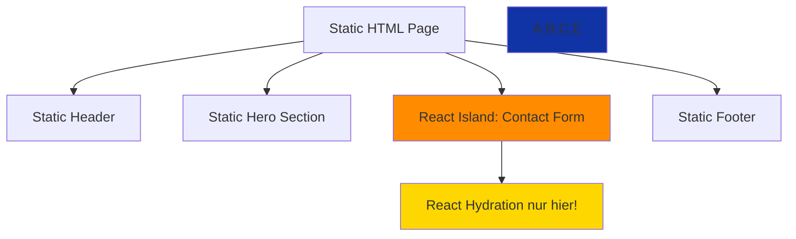

# Design Document

## Overview

Die Migration von Next.js 15 zu Astro 4.x ist eine **strategische Replatforming-Entscheidung** für die HEADON.pro Marketing-Website. Während Next.js ein hervorragendes Framework für interaktive Web-Apps ist, ist Astro speziell für **content-fokussierte Websites** optimiert und liefert messbar bessere Performance durch seine **Islands Architecture** und **Static-First-Ansatz**.

**Kern-Design-Prinzipien:**

1. **Zero-JavaScript by Default**: Nur laden, wo tatsächlich Interaktivität benötigt wird
2. **Parallele Migration**: Next.js bleibt produktiv während Astro-Version entsteht
3. **Design-Parität**: Pixel-perfekte Übereinstimmung mit Next.js-Version
4. **Performance-First**: Jede Entscheidung wird anhand von Core Web Vitals bewertet
5. **Developer-Friendly**: Gleiche oder bessere DX wie Next.js

**Migrations-Zielarchitektur:**

```
~/projects/headon-astro/          # Neues Astro-Projekt
├── src/
│   ├── pages/                   # File-based Routing (wie Next.js app/)
│   ├── components/              # Astro + React Islands
│   ├── layouts/                 # Layout-Wrapper
│   ├── content/                 # Content Collections (MDX)
│   └── lib/                     # Utilities (wiederverwendet)
├── public/                      # Static Assets (1:1 kopiert)
└── astro.config.mjs            # Astro-Konfiguration
```

## Steering Document Alignment

### Technical Standards (tech.md)

**Alignment mit bestehenden Tech-Entscheidungen:**

1. **TypeScript Strict Mode** ✅
   - Astro unterstützt TypeScript nativ mit gleicher Strict-Mode-Konfiguration
   - `.astro`-Files können TypeScript in Frontmatter nutzen
   - React-Islands behalten TypeScript-Typing bei

2. **pnpm Package Manager** ✅
   - Astro funktioniert perfekt mit pnpm (getestet)
   - Gleiche pnpm-Version (10.15.0) wird verwendet
   - Workspace-fähig für zukünftige Monorepo-Struktur

3. **Tailwind CSS v4** ✅
   - Astro hat offizielle Tailwind-Integration (`@astrojs/tailwind`)
   - `@theme` Syntax in `globals.css` wird 1:1 übernommen
   - CSS-in-CSS Konfiguration (kein tailwind.config.js nötig)

4. **Supabase Backend** ✅
   - `@supabase/supabase-js` funktioniert identisch in Astro
   - API-Routes werden zu Astro-Endpoints (`src/pages/api/*.ts`)
   - Service-Role-Key für Server-Side, Anon-Key für Client-Side

5. **shadcn/ui Komponenten** ⚙️ Adaption
   - Primitive Komponenten als React-Islands (`client:load`)
   - Oder Konvertierung zu nativen Astro-Komponenten (statisch)
   - Radix-UI funktioniert in React-Islands

**Neue Technologie-Entscheidungen:**

| Technologie           | Zweck                       | Begründung                                                 |
| --------------------- | --------------------------- | ---------------------------------------------------------- |
| **Astro 4.15+**       | Static Site Generator + SSR | Optimiert für Content-Sites, 90% weniger JS                |
| **@astrojs/tailwind** | Tailwind-Integration        | Offizielle Integration, 0-Config                           |
| **@astrojs/react**    | React-Islands               | Für interaktive Komponenten (Forms, etc.)                  |
| **@astrojs/mdx**      | MDX-Support                 | Natives MDX mit besserer Performance als `next-mdx-remote` |
| **@astrojs/sitemap**  | Sitemap-Generierung         | Automatische sitemap.xml                                   |
| **Shiki** (built-in)  | Code-Highlighting           | In Astro eingebaut, keine extra Config                     |

### Project Structure (structure.md)

**Mapping von Next.js zu Astro:**

```typescript
// Next.js Structure              →  Astro Structure
app/                                  src/pages/
├── page.tsx                     →    ├── index.astro
├── layout.tsx                   →    ├── layouts/Layout.astro
├── about/page.tsx               →    ├── about.astro
├── services/page.tsx            →    ├── services/index.astro
├── services/[slug]/page.tsx     →    ├── services/[slug].astro
├── api/contact/route.ts         →    ├── api/contact.ts (Endpoint)
└── globals.css                  →  src/styles/globals.css

components/                           src/components/
├── ui/                          →    ├── ui/ (React Islands)
│   ├── button.tsx               →    │   └── Button.tsx (client:load)
├── sections/                    →    ├── sections/
│   ├── HeroSection.tsx          →    │   └── HeroSection.astro (native)
├── layout/                      →    ├── layout/
│   ├── Header.tsx               →    │   └── Header.astro
│   └── Footer.tsx               →    │   └── Footer.astro

lib/                                  src/lib/
├── utils.ts                     →    ├── utils.ts (1:1 copy)
├── supabase.ts                  →    ├── supabase.ts (minimal changes)
└── validations.ts               →    └── validations.ts (1:1 copy)

public/                               public/
└── ** (alle Dateien)            →    └── ** (1:1 copy)
```

**Naming Conventions (beibehalten):**

- Astro-Komponenten: `PascalCase.astro` (z.B. `HeroSection.astro`)
- React-Islands: `PascalCase.tsx` mit `'use client'` entfernt
- Routes: `kebab-case.astro` oder `index.astro` in Ordnern
- Utilities: `camelCase.ts` (identisch zu Next.js)

## Code Reuse Analysis

### Existing Components to Leverage

**1:1 Wiederverwendung (keine Änderungen):**

- ✅ **`lib/utils.ts`**: `cn()` Funktion - funktioniert identisch in Astro
- ✅ **`lib/validations.ts`**: Zod-Schemas - keine Änderungen nötig
- ✅ **`public/*`**: Alle Assets (Bilder, Logos, Fonts) - 1:1 Copy
- ✅ **`app/globals.css`**: Tailwind v4 Config - nur Pfad ändern zu `src/styles/`
- ✅ **Type Definitions**: Interface-Definitionen wiederverwendbar

**Minimale Anpassungen (80-90% wiederverwendbar):**

- ⚙️ **`lib/supabase.ts`**:

  ```typescript
  // Next.js
  import { createClient } from '@supabase/supabase-js'

  // Astro (identisch, nur Import-Kontext)
  import { createClient } from '@supabase/supabase-js'
  // Funktioniert in .astro Frontmatter und API-Endpoints
  ```

- ⚙️ **React-Hook-Form Komponenten**:
  - Bleiben als React-Components (`.tsx`)
  - Werden als React-Islands eingebunden: `<ContactForm client:load />`

**Konvertierung zu Astro (neue Implementation):**

- 🔄 **Statische Sections** (13 Komponenten):
  - `HeroSection.tsx` → `HeroSection.astro` (kein React nötig)
  - `ProcessSection.tsx` → `ProcessSection.astro`
  - `PricingSection.tsx` → `PricingSection.astro`
  - etc.

- 🔄 **Layout-Komponenten**:
  - `Header.tsx` → `Header.astro` (mit interaktivem Mobile-Menu als Island)
  - `Footer.tsx` → `Footer.astro` (komplett statisch)

### Integration Points

**Supabase Backend:**

- **Client-Side**: Identische `@supabase/supabase-js` Usage
- **Server-Side**: Astro-Endpoints statt Next.js Route Handlers
- **Authentication**: Supabase Auth bleibt gleich
- **Database**: Keine Änderungen an Schema oder RLS-Policies

**API-Endpoints:**

```typescript
// Next.js: app/api/contact/route.ts
export async function POST(request: NextRequest) { ... }

// Astro: src/pages/api/contact.ts
export async function POST({ request }: APIContext) {
  const body = await request.json()
  // Rest identisch
}
```

**MDX-Content:**

```typescript
// Next.js: next-mdx-remote mit komplexer Config
import { serialize } from 'next-mdx-remote/serialize'

// Astro: Native Content Collections
import { getCollection } from 'astro:content'
const posts = await getCollection('blog')
```

## Architecture

### Islands Architecture (Astro's Killer-Feature)

**Konzept:** "Inseln" von Interaktivität in einem Ozean von statischem HTML.



**Rendering-Strategie:**

| Komponente      | Strategie                       | Begründung                                |
| --------------- | ------------------------------- | ----------------------------------------- |
| Header          | Astro-Component                 | Statisch, Navigation als Alpine.js        |
| Hero Section    | Astro-Component                 | Animationen via CSS oder View Transitions |
| Process Section | Astro-Component                 | Statischer Content                        |
| Pricing Section | Astro-Component                 | Statische Cards                           |
| Contact Form    | React Island (`client:load`)    | Interaktiv: Form-State, Validation        |
| Footer          | Astro-Component                 | Komplett statisch                         |
| Mobile Menu     | React Island (`client:visible`) | Toggle-State nötig                        |

**Island Loading-Strategien:**

```astro
<!-- 1. Sofort laden (für kritische Interaktivität) -->
<ContactForm client:load />

<!-- 2. Wenn sichtbar (für below-the-fold Content) -->
<MobileMenu client:visible />

<!-- 3. Wenn Browser idle (für non-kritische Features) -->
<NewsletterForm client:idle />

<!-- 4. Nur auf Mobile (conditional) -->
<MobileNav client:media="(max-width: 768px)" />
```

### Modular Design Principles

**File Responsibility:**

```
src/components/
├── ui/                      # Atomic Design: Atoms
│   ├── Button.tsx          # React Island (interaktiv)
│   ├── Input.astro         # Astro (statisch)
│   └── Label.astro         # Astro (statisch)
├── sections/               # Organisms
│   ├── HeroSection.astro   # Statisch, nutzt Atoms
│   ├── ProcessSection.astro
│   └── ContactSection.astro # Nutzt ContactForm-Island
├── layout/                 # Templates
│   ├── Header.astro
│   └── Footer.astro
└── islands/                # Interaktive Komponenten
    ├── ContactForm.tsx     # React mit Hook Form
    └── MobileMenu.tsx      # React mit State
```

**Component Isolation:**

- Astro-Komponenten sind per Definition isoliert (kein Global-State)
- React-Islands kommunizieren via Props oder Custom Events
- Kein Prop-Drilling durch `nanostores` (Astro's State-Management)

**Service Layer Separation:**

```
src/
├── lib/
│   ├── services/          # Business Logic
│   │   ├── contact.service.ts    # Kontaktformular-Logik
│   │   └── blog.service.ts       # Blog-Content-Logik
│   ├── api/               # API-Clients
│   │   └── supabase.ts
│   └── utils/             # Pure Utilities
│       ├── date.ts
│       └── format.ts
```

## Components and Interfaces

### Component 1: Layout System

**Purpose:** Root-Layout für alle Seiten mit konsistentem Header/Footer

**File:** `src/layouts/Layout.astro`

**Interface:**

```typescript
interface LayoutProps {
  title: string
  description: string
  image?: string
  canonical?: string
}
```

**Implementation:**

```astro
---
// src/layouts/Layout.astro
import Header from '@/components/layout/Header.astro'
import Footer from '@/components/layout/Footer.astro'
import '@/styles/globals.css'

interface Props {
  title: string
  description: string
  image?: string
  canonical?: string
}

const { title, description, image, canonical } = Astro.props
const siteUrl = import.meta.env.SITE || 'https://headon.pro'
---

<!DOCTYPE html>
<html lang="de">
  <head>
    <meta charset="UTF-8" />
    <meta name="viewport" content="width=device-width, initial-scale=1.0" />
    <title>{title}</title>
    <meta name="description" content={description} />
    {canonical && <link rel="canonical" href={canonical} />}
    <!-- SEO Meta Tags -->
    <meta property="og:title" content={title} />
    <meta property="og:description" content={description} />
    {image && <meta property="og:image" content={image} />}
  </head>
  <body>
    <Header />
    <main>
      <slot />
    </main>
    <Footer />
  </body>
</html>
```

**Dependencies:** Header.astro, Footer.astro, globals.css

**Reuses:** Next.js layout-Konzept, Metadata-Pattern

### Component 2: Hero Section (Native Astro)

**Purpose:** Homepage-Hero mit animiertem Background (CSS-Animationen statt Framer Motion)

**File:** `src/components/sections/HeroSection.astro`

**Interface:**

```typescript
interface HeroSectionProps {
  title: string
  subtitle: string
  ctaText: string
  ctaLink: string
}
```

**Implementation-Strategy:**

- **Animationen:** CSS `@keyframes` statt Framer Motion (bereits in globals.css vorhanden)
- **Gradient-Shift:** Nutze bestehende `@keyframes gradient-shift` Animation
- **Responsive:** Tailwind Breakpoints identisch zu Next.js
- **Performance:** 0KB JavaScript für Hero-Section

**Reuses:**

- `app/globals.css` Animationen (blob, gradient-shift)
- Tailwind-Classes identisch
- Next.js HeroSection als Design-Referenz

### Component 3: Contact Form (React Island)

**Purpose:** Multi-Step Kontaktformular mit React Hook Form + Zod

**File:** `src/components/islands/ContactForm.tsx`

**Interface:**

```typescript
import type { z } from 'zod'
import { contactSchema } from '@/lib/validations'

type ContactFormData = z.infer<typeof contactSchema>

interface ContactFormProps {
  className?: string
}
```

**Implementation:**

```tsx
// src/components/islands/ContactForm.tsx
import { useForm } from 'react-hook-form'
import { zodResolver } from '@hookform/resolvers/zod'
import { contactSchema } from '@/lib/validations'
import { Button } from '@/components/ui/Button'

export default function ContactForm({ className }: ContactFormProps) {
  const form = useForm<ContactFormData>({
    resolver: zodResolver(contactSchema),
  })

  async function onSubmit(data: ContactFormData) {
    const response = await fetch('/api/contact', {
      method: 'POST',
      headers: { 'Content-Type': 'application/json' },
      body: JSON.stringify(data),
    })
    // ... error handling
  }

  return (
    <form onSubmit={form.handleSubmit(onSubmit)} className={className}>
      {/* Form fields - identisch zu Next.js */}
    </form>
  )
}
```

**Usage in Astro:**

```astro
---
// src/pages/contact.astro
import Layout from '@/layouts/Layout.astro'
import ContactForm from '@/components/islands/ContactForm'
---

<Layout title="Kontakt">
  <section>
    <h1>Kontaktieren Sie uns</h1>
    <ContactForm client:load />
  </section>
</Layout>
```

**Dependencies:** React Hook Form, Zod, Button-Component

**Reuses:**

- `lib/validations.ts` (1:1)
- Next.js ContactForm-Logik
- Bestehende Form-Components

### Component 4: Content Collections (Blog-System)

**Purpose:** Type-safe MDX-Content mit Astro Content Collections

**File:** `src/content/config.ts`

**Implementation:**

```typescript
// src/content/config.ts
import { defineCollection, z } from 'astro:content'

const blogCollection = defineCollection({
  type: 'content',
  schema: z.object({
    title: z.string(),
    description: z.string(),
    pubDate: z.date(),
    author: z.string().default('HEADON Team'),
    image: z.string().optional(),
    tags: z.array(z.string()).default([]),
  }),
})

export const collections = {
  blog: blogCollection,
}
```

**Usage:**

```astro
---
// src/pages/blog/[slug].astro
import { getCollection } from 'astro:content'
import Layout from '@/layouts/Layout.astro'

export async function getStaticPaths() {
  const posts = await getCollection('blog')
  return posts.map(post => ({
    params: { slug: post.slug },
    props: { post }
  }))
}

const { post } = Astro.props
const { Content } = await post.render()
---

<Layout title={post.data.title}>
  <article>
    <h1>{post.data.title}</h1>
    <Content />
  </article>
</Layout>
```

**Dependencies:** Astro Content Collections API, Zod

**Reuses:**

- Bestehende MDX-Files aus `content/blog/`
- Frontmatter-Schema (kompatibel)

## Data Models

### Content Collection Schema

```typescript
// src/content/config.ts
const blogPost = z.object({
  title: z.string(),
  description: z.string(),
  pubDate: z.date(),
  updatedDate: z.date().optional(),
  author: z.string().default('HEADON Team'),
  image: z.string().optional(),
  tags: z.array(z.string()).default([]),
  draft: z.boolean().default(false),
})

const serviceSchema = z.object({
  title: z.string(),
  description: z.string(),
  icon: z.string(),
  features: z.array(z.string()),
  pricing: z
    .object({
      from: z.number(),
      duration: z.string(),
    })
    .optional(),
})

const portfolioSchema = z.object({
  title: z.string(),
  description: z.string(),
  client: z.string(),
  year: z.number(),
  technologies: z.array(z.string()),
  image: z.string(),
  url: z.string().url().optional(),
})
```

### Supabase Data Models (unverändert)

```typescript
// src/types/supabase.ts
// 1:1 aus Next.js übernommen

export interface ContactSubmission {
  id: string
  name: string
  email: string
  company?: string
  message: string
  created_at: string
}
```

## Error Handling

### Error Scenarios

1. **Scenario: API-Endpoint Fehler (Kontaktformular)**
   - **Handling:** Try-Catch in Astro-Endpoint, JSON-Error-Response
   - **User Impact:** Toast-Notification mit Fehlermeldung

   ```typescript
   // src/pages/api/contact.ts
   export async function POST({ request }: APIContext) {
     try {
       const data = await request.json()
       const validated = contactSchema.parse(data)
       // ... Supabase insert
       return new Response(JSON.stringify({ success: true }), { status: 200 })
     } catch (error) {
       return new Response(JSON.stringify({ error: 'Validation failed' }), { status: 400 })
     }
   }
   ```

2. **Scenario: MDX-Content nicht gefunden**
   - **Handling:** Astro wirft 404 automatisch bei ungültigen Slugs
   - **User Impact:** Custom 404-Page mit hilfreichen Links

   ```astro
   ---
   // src/pages/404.astro
   import Layout from '@/layouts/Layout.astro'
   ---
   <Layout title="404 - Seite nicht gefunden">
     <h1>Seite nicht gefunden</h1>
     <a href="/">Zurück zur Startseite</a>
   </Layout>
   ```

3. **Scenario: Build-Fehler (TypeScript/Zod)**
   - **Handling:** Build schlägt fehl, CI/CD verhindert Deployment
   - **User Impact:** Keine - Fehler wird vor Production gefangen
   - **Developer Impact:** Klare Fehlermeldung in Build-Logs

4. **Scenario: React-Island Hydration-Fehler**
   - **Handling:** Error Boundary in React-Island
   - **User Impact:** Fallback-UI, Formular bleibt nutzbar

   ```tsx
   // src/components/islands/ContactForm.tsx
   import { ErrorBoundary } from 'react-error-boundary'

   function ErrorFallback() {
     return <div>Formular konnte nicht geladen werden. Bitte kontaktieren Sie uns per E-Mail.</div>
   }

   export default function ContactFormWrapper() {
     return (
       <ErrorBoundary FallbackComponent={ErrorFallback}>
         <ContactForm />
       </ErrorBoundary>
     )
   }
   ```

## Testing Strategy

### Unit Testing

**Approach:** Vitest (Astro's bevorzugtes Test-Framework)

```bash
# Installation
pnpm add -D vitest @vitest/ui

# package.json
{
  "scripts": {
    "test": "vitest",
    "test:ui": "vitest --ui"
  }
}
```

**Key Components to Test:**

- `lib/utils.ts` - `cn()` Funktion
- `lib/validations.ts` - Zod-Schemas
- `lib/services/*` - Business-Logik
- React-Islands - Formular-Validierung, State-Management

**Example:**

```typescript
// lib/utils.test.ts
import { describe, it, expect } from 'vitest'
import { cn } from './utils'

describe('cn utility', () => {
  it('merges classes correctly', () => {
    expect(cn('foo', 'bar')).toBe('foo bar')
    expect(cn('foo', { bar: true })).toBe('foo bar')
  })
})
```

### Integration Testing

**Approach:** Playwright (bereits im Projekt vorhanden)

**Key Flows to Test:**

1. **Navigation Flow:** Homepage → Services → Contact
2. **Contact Form Flow:** Ausfüllen → Validierung → Submission → Success
3. **Blog Flow:** Blog-Liste → Artikel → Zurück
4. **Responsive Flow:** Mobile-Menu → Navigation → Close

**Example:**

```typescript
// tests/contact-form.spec.ts
import { test, expect } from '@playwright/test'

test('contact form submission', async ({ page }) => {
  await page.goto('/contact')
  await page.fill('[name="name"]', 'Test User')
  await page.fill('[name="email"]', 'test@example.com')
  await page.fill('[name="message"]', 'Test message')
  await page.click('button[type="submit"]')

  await expect(page.locator('.success-message')).toBeVisible()
})
```

### End-to-End Testing

**Approach:** Lighthouse CI für Performance-Tests

```bash
# Installation
pnpm add -D @lhci/cli

# lighthouserc.json
{
  "ci": {
    "collect": {
      "url": ["http://localhost:4321"],
      "numberOfRuns": 3
    },
    "assert": {
      "assertions": {
        "categories:performance": ["error", { "minScore": 0.98 }],
        "categories:accessibility": ["error", { "minScore": 0.95 }],
        "categories:seo": ["error", { "minScore": 0.95 }]
      }
    }
  }
}
```

**User Scenarios to Test:**

1. **First-Time Visitor:** Homepage Load → LCP < 1.0s → Interactive < 2s
2. **Returning Visitor:** Cached Assets → LCP < 0.5s
3. **Mobile User:** Touch-Targets ≥ 48px → Viewport correct
4. **SEO Crawler:** Meta-Tags vorhanden → Structured Data valid

### Performance Benchmarking

**Baseline (Next.js):**

- LCP: ~1.5s
- TTI: ~2-3s
- Bundle: ~200-300KB
- Lighthouse: 85-95

**Target (Astro):**

- LCP: < 1.0s
- TTI: < 1.5s
- Bundle: < 50KB
- Lighthouse: 98-100

**Measurement:**

```bash
# Build beiden Versionen
cd ~/projects/headon && pnpm build
cd ~/projects/headon-astro && pnpm build

# Lighthouse-Vergleich
lhci autorun --config=lighthouserc.json

# Bundle-Analyse
cd ~/projects/headon-astro
pnpm astro build --analyze
```

## Migration Phases

### Phase 1: Foundation (Woche 1)

**Tasks:**

1. Astro-Projekt initialisieren (`pnpm create astro@latest`)
2. Tailwind v4 + Integrations installieren
3. `globals.css` übertragen
4. `lib/utils.ts` + `lib/validations.ts` kopieren
5. Layout-Struktur aufbauen (`Layout.astro`, `Header.astro`, `Footer.astro`)

**Deliverable:** Leeres Astro-Projekt mit Design-System

### Phase 2: Static Pages (Woche 1-2)

**Tasks:**

1. Homepage migrieren (`index.astro`)
2. Statische Sections konvertieren (Hero, Process, Pricing)
3. About-Page migrieren
4. Legal-Pages migrieren (Imprint, Privacy, Terms)

**Deliverable:** Alle statischen Seiten funktional

### Phase 3: Dynamic Content (Woche 2)

**Tasks:**

1. Content Collections Setup (`src/content/config.ts`)
2. Blog-Posts migrieren
3. Blog-Liste + Detail-Pages
4. Services-Pages (mit Dynamic Routes)
5. Portfolio-Pages

**Deliverable:** Alle Content-Pages funktional

### Phase 4: Interactivity (Woche 2-3)

**Tasks:**

1. React-Integration testen
2. Contact-Form als Island
3. Mobile-Menu als Island
4. API-Endpoints migrieren (`/api/contact`)
5. Supabase-Integration testen

**Deliverable:** Alle interaktiven Features funktional

### Phase 5: Optimization (Woche 3)

**Tasks:**

1. Performance-Tests (Lighthouse)
2. SEO-Audit (Meta-Tags, Sitemap, Robots)
3. Image-Optimization
4. Bundle-Analyse
5. Accessibility-Tests

**Deliverable:** Production-Ready Astro-Version

### Phase 6: Deployment (Woche 3-4)

**Tasks:**

1. Docker-Setup für Astro
2. CI/CD Pipeline anpassen
3. Beta-Deployment (`beta.headon.pro`)
4. A/B-Test (10% Traffic)
5. Full-Rollout

**Deliverable:** Live Astro-Website

## Risk Mitigation

| Risk                                         | Impact | Likelihood | Mitigation                             |
| -------------------------------------------- | ------ | ---------- | -------------------------------------- |
| Framer Motion Animationen nicht replizierbar | Medium | Low        | CSS-Animationen + View Transitions API |
| React-Islands zu groß                        | High   | Medium     | Code-Splitting, lazy Loading           |
| SEO-Rankings sinken                          | High   | Low        | Pre-Launch SEO-Audit, Canonical-Tags   |
| Breaking Changes in Dependencies             | Medium | Medium     | Lock-File committen, staged Rollout    |
| Team-Onboarding schwierig                    | Low    | Low        | Astro ist einfacher als Next.js        |

## Success Metrics

**Migration gilt als erfolgreich, wenn:**

1. ✅ Lighthouse Performance ≥ 98 (aktuell 85-95)
2. ✅ LCP < 1.0s (aktuell ~1.5s)
3. ✅ JavaScript Bundle < 50KB (aktuell ~200-300KB)
4. ✅ Build-Size < 100MB (aktuell 439MB)
5. ✅ Alle 10 Requirements aus requirements.md erfüllt
6. ✅ Keine SEO-Ranking-Verluste nach 30 Tagen
7. ✅ Build-Zeit < 15s (aktuell 30-60s)
8. ✅ Zero Critical Accessibility Issues
