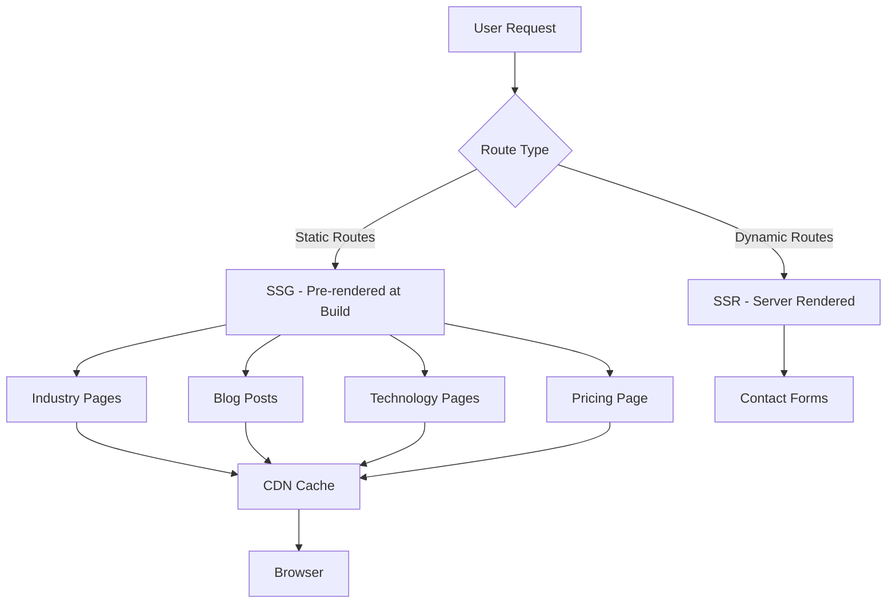
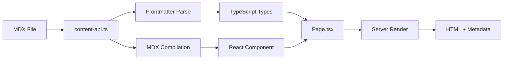

# Design Document: SEO & Keyword Optimization

## Overview

This design document specifies the technical implementation of the SEO & Keyword Optimization feature for HEADON.pro. The implementation leverages Next.js 15's App Router, Server Components, and Metadata API to achieve superior SEO performance while maintaining the existing 95+ Lighthouse score.

**Architecture Approach**:

- Server-first rendering for optimal SEO crawlability
- MDX-based content management for flexibility
- Component-based design leveraging existing UI patterns
- Static generation for maximum performance

**Key Design Principles**:

1. **Reuse Existing Patterns**: Follow established regional page patterns (app/regionen/[city])
2. **Maintainable Content**: MDX frontmatter + content for easy updates
3. **Performance First**: All new pages target <1.5s LCP, 95+ Lighthouse
4. **Modular Components**: Single-purpose, reusable components

## Steering Document Alignment

### Technical Standards (tech.md)

**Language & Framework Compliance**:

- ✅ TypeScript 5.9.2 with strict mode for all components
- ✅ Next.js 15.5.2 App Router with Server Components as default
- ✅ React 19.1.1 for UI components

**Styling & UI**:

- ✅ Tailwind CSS 4.1.13 for all styling
- ✅ shadcn/ui components (Button, Select, Accordion, etc.) where applicable
- ✅ Framer Motion for animations (if needed on client components)

**Forms & Validation**:

- ✅ React Hook Form 7.62.0 for PriceCalculator interactive form
- ✅ Zod 4.1.5 for schema validation (if contact forms on landing pages)

**Performance Requirements** (from tech.md):

- ✅ Page Load Time (LCP): < 1.5 seconds ✓
- ✅ Time to Interactive (TTI): < 3 seconds ✓
- ✅ Lighthouse Score: 95+ maintained ✓
- ✅ Initial Bundle Size: < 200KB (no heavy dependencies added) ✓

**SEO Standards** (from tech.md):

- ✅ Next.js Metadata API for all pages
- ✅ Open Graph tags for social sharing
- ✅ Schema.org structured data (LocalBusiness, Article)
- ✅ Automatic sitemap.xml generation via Next.js

**Development Tools**:

- ✅ ESLint 9.35.0 for code quality
- ✅ Prettier 3.6.2 for consistent formatting
- ✅ pnpm 10.15.0 as package manager

### Project Structure (structure.md)

**File Organization**:

```
app/
├── branchen/                    # Industry landing pages (NEW)
│   ├── [branche]/
│   │   ├── page.tsx            # Dynamic industry page
│   │   └── metadata.ts         # Metadata generation
│   └── page.tsx                # Industry overview
├── preise/                      # Pricing page (NEW)
│   └── page.tsx
├── blog/                        # Existing, will add posts
│   └── [slug]/page.tsx
└── technologie/                 # Technology pages (NEW)
    └── [tech]/page.tsx

components/
├── sections/
│   ├── BrancheContent.tsx      # Industry page layout (NEW)
│   ├── PricingCalculator.tsx   # Interactive calculator (NEW)
│   ├── PricingTable.tsx        # Price packages (NEW)
│   └── BlogPostContent.tsx     # Blog post layout (NEW)
└── seo/
    ├── StructuredData.tsx      # JSON-LD schema (exists, extend)
    └── Breadcrumbs.tsx         # Navigation breadcrumbs (exists)

content/
├── branchen/                    # Industry MDX content (NEW)
│   ├── gastronomie.mdx
│   ├── handwerk.mdx
│   ├── einzelhandel.mdx
│   ├── beratung.mdx
│   ├── immobilien.mdx
│   └── fitness.mdx
├── blog/                        # Blog MDX content (NEW)
│   ├── website-kosten-2025.mdx
│   ├── website-erstellen-lassen.mdx
│   └── ...
└── technologie/                 # Technology MDX content (NEW)
    ├── next-js-agentur.mdx
    └── ...

lib/content/
└── content-api.ts              # Extend with getBranchePage, getBlogPost
```

**Naming Conventions** (from structure.md):

- ✅ Route folders: `kebab-case` (branchen, preise, technologie)
- ✅ Component files: `PascalCase.tsx` (BrancheContent.tsx)
- ✅ MDX content: `kebab-case.mdx` (gastronomie.mdx)
- ✅ Utility files: `camelCase.ts` (content-api.ts)

**Import Pattern**:

```typescript
// 1. React/Next.js
import type { Metadata } from 'next'
import Link from 'next/link'

// 2. External dependencies
import { motion } from 'framer-motion'

// 3. Internal components
import { Button } from '@/components/ui/button'
import HeroSection from '@/components/sections/HeroSection'

// 4. Utilities
import { cn } from '@/lib/utils'
import { getBranchePage } from '@/lib/content/content-api'

// 5. Types
import type { BranchePageData } from '@/lib/types/content'
```

**Code Size Guidelines**:

- Component files: ≤ 300 lines (target: 100-200)
- Page files: ≤ 200 lines (compose sections)
- MDX content: No hard limit (content-driven)

## Code Reuse Analysis

### Existing Components to Leverage

**1. Layout Components** (components/layout/)

- ✅ **Header.tsx**: Will update navigation to include "Branchen" menu item
- ✅ **Footer.tsx**: Will add links to new sections (Branchen, Preise, Blog)

**2. UI Primitives** (components/ui/)

- ✅ **Button**: CTA buttons on all landing pages
- ✅ **Accordion**: FAQ sections on industry pages
- ✅ **Select**: PriceCalculator form inputs
- ✅ **Card**: Pricing packages, feature grids

**3. SEO Components** (components/seo/)

- ✅ **StructuredData.tsx**: Extend with Article, Service schema types
- ✅ **Breadcrumbs.tsx**: Use on all landing pages
- ✅ **PageHeader.tsx**: Reuse for consistent headers

**4. Section Components** (components/sections/)

- ✅ **IndustryNavigator.tsx**: Update to link to dedicated industry pages
- ✅ **ProcessSection.tsx**: Reuse on technology pages
- ✅ **TrustPersonalitySection.tsx**: Reuse on pricing page

**5. Content API** (lib/content/content-api.ts)

- ✅ **getCityPage()**: Pattern for getBranchePage()
- ✅ **getServicePage()**: Pattern for getTechnologyPage()
- ✅ **compileMDXContent()**: Reuse for all new MDX content

### Integration Points

**1. Existing Regional Pages** (app/regionen/[city])

- **Integration**: Industry pages follow identical pattern
- **Reuse**: Same metadata generation approach
- **Reuse**: Same MDX + Server Component pattern

**2. Navigation System** (components/layout/Header.tsx)

- **Integration**: Add "Branchen" dropdown with 6 industry links
- **Integration**: Add "Ratgeber" (Blog) link
- **Integration**: Add "Preise" link

**3. IndustryNavigator Component** (components/sections/IndustryNavigator.tsx)

- **Current State**: Displays 6 industries (Gastronomie, Handwerk, Einzelhandel, Beratung, Immobilien, Fitness)
- **Integration**: Update each industry card to link to `/branchen/[id]`
- **Code Change**: Wrap cards in `<Link href={`/branchen/${industry.id}`}>`

**4. Sitemap Generation** (app/sitemap.ts)

- **Integration**: Add new routes to sitemap
  - /branchen + 6 industry pages
  - /preise
  - /blog + all blog posts
  - /technologie + 6 technology pages

**5. Supabase (Optional - Future)**

- **No Integration Required**: All content is static MDX
- **Future**: Contact form submissions on landing pages use existing Supabase contact table

## Architecture

### Overall Architecture Pattern

**Hybrid Rendering Strategy**:



### Modular Design Principles

**1. Single File Responsibility**:

- Each industry page: One `page.tsx` + one `[branche].mdx`
- Each blog post: One `[slug]/page.tsx` + one `blog-post.mdx`
- Each component: One clear purpose (BrancheContent only renders industry pages)

**2. Component Isolation**:

- `BrancheContent.tsx`: Renders industry page sections
- `PricingCalculator.tsx`: Interactive price calculator (isolated state)
- `PricingTable.tsx`: Static pricing display
- `BlogPostContent.tsx`: Blog post layout with TOC, author, share buttons

**3. Service Layer Separation**:

- **Data Access**: `lib/content/content-api.ts` (getBranchePage, getBlogPost)
- **Business Logic**: Frontmatter validation, content compilation
- **Presentation**: React components in `components/`

**4. Utility Modularity**:

- `lib/validations.ts`: Extend with PriceCalculator schema
- `lib/utils.ts`: Add `generateBreadcrumbs()` utility

### Data Flow



## Components and Interfaces

### Component 1: BrancheContent.tsx

**Purpose**: Server Component that renders complete industry landing page

**File**: `components/sections/BrancheContent.tsx`

**Interfaces**:

```typescript
interface BrancheContentProps {
  branche: string
  content: BranchePageData
}

interface BranchePageData {
  frontmatter: {
    name: string
    icon: string
    heroTitle: string
    heroSubtitle: string
    features: Feature[]
    pricing: PricingInfo
    faqs: FAQ[]
    caseStudies?: string[]
  }
  content: string
}

interface Feature {
  title: string
  description: string
  icon: string
}

interface PricingInfo {
  from: number
  to?: number
  currency: string
}

interface FAQ {
  question: string
  answer: string
}
```

**Dependencies**:

- `@/components/ui/button` (CTA buttons)
- `@/components/ui/accordion` (FAQ section)
- `@/components/seo/Breadcrumbs` (navigation)
- `lucide-react` (icons)

**Reuses**:

- **CityPageContent.tsx pattern**: Similar structure with hero, features, FAQs
- **Existing section components**: Can embed ProcessSection, TrustSection

**Rendering Strategy**: Server Component (no client interactivity except FAQ accordion)

---

### Component 2: PricingCalculator.tsx

**Purpose**: Client Component with interactive price calculator form

**File**: `components/sections/PricingCalculator.tsx`

**Interfaces**:

```typescript
'use client'

interface PricingCalculatorProps {
  className?: string
}

interface CalculatorFormData {
  projectType: 'website' | 'webapp' | 'app' | 'ecommerce'
  complexity: 'simple' | 'medium' | 'complex'
  features: string[] // ['seo', 'cms', 'analytics', 'branding', etc.]
  pages?: number
  customFeatures?: string
}

interface PriceEstimate {
  basePrice: number
  featuresCost: number
  complexityMultiplier: number
  total: number
  timeframe: string
}
```

**Dependencies**:

- `react-hook-form` (form state)
- `zod` (validation schema)
- `@/components/ui/select` (dropdowns)
- `@/components/ui/button` (submit button)
- `framer-motion` (price update animations)

**State Management**:

```typescript
const [estimate, setEstimate] = useState<PriceEstimate | null>(null)
const form = useForm<CalculatorFormData>({
  resolver: zodResolver(calculatorSchema),
})

// Real-time calculation on form change
useEffect(() => {
  const subscription = form.watch((values) => {
    const calculated = calculatePrice(values)
    setEstimate(calculated)
  })
  return () => subscription.unsubscribe()
}, [form])
```

**Calculation Logic**:

```typescript
function calculatePrice(data: CalculatorFormData): PriceEstimate {
  const basePrices = {
    website: 5000,
    webapp: 15000,
    app: 20000,
    ecommerce: 12000,
  }

  const complexityMultipliers = {
    simple: 1.0,
    medium: 1.5,
    complex: 2.5,
  }

  const featureCosts = {
    seo: 1500,
    cms: 2000,
    analytics: 500,
    branding: 3000,
    // ... more
  }

  const basePrice = basePrices[data.projectType]
  const multiplier = complexityMultipliers[data.complexity]
  const featuresCost = data.features.reduce((sum, f) => sum + (featureCosts[f] || 0), 0)

  return {
    basePrice,
    featuresCost,
    complexityMultiplier: multiplier,
    total: basePrice * multiplier + featuresCost,
    timeframe: estimateTimeframe(data),
  }
}
```

**Reuses**:

- **React Hook Form pattern**: Same as contact form
- **Zod validation**: Same pattern as lib/validations.ts

---

### Component 3: PricingTable.tsx

**Purpose**: Server Component displaying static pricing packages

**File**: `components/sections/PricingTable.tsx`

**Interfaces**:

```typescript
interface PricingTableProps {
  packages: PricingPackage[]
}

interface PricingPackage {
  name: string
  description: string
  price: number
  currency: string
  features: string[]
  highlighted?: boolean
  ctaText: string
  ctaLink: string
}
```

**Dependencies**:

- `@/components/ui/button` (CTA buttons)
- `lucide-react` (CheckCircle icons)

**Data Source**:

```typescript
// lib/content/pricing-data.ts
export const pricingPackages: PricingPackage[] = [
  {
    name: 'Basis',
    description: 'Für kleine Unternehmen und Startups',
    price: 2500,
    currency: 'EUR',
    features: [
      'Responsive Website (5-8 Seiten)',
      'CMS Integration',
      'SEO-Grundoptimierung',
      // ...
    ],
    ctaText: 'Jetzt anfragen',
    ctaLink: '/contact?package=basis',
  },
  // ... Professional, Premium
]
```

**Reuses**:

- **Card layout pattern**: Similar to service cards on homepage

---

### Component 4: BlogPostContent.tsx

**Purpose**: Server Component for blog post layout with TOC, sharing, related posts

**File**: `components/sections/BlogPostContent.tsx`

**Interfaces**:

```typescript
interface BlogPostContentProps {
  post: BlogPostData
  relatedPosts: BlogPostData[]
}

interface BlogPostData {
  frontmatter: {
    title: string
    description: string
    author: string
    publishDate: string
    readingTime: number
    tags: string[]
    featuredImage: string
    relatedPosts?: string[]
  }
  content: string
  tableOfContents: TOCItem[]
}

interface TOCItem {
  id: string
  title: string
  level: number
}
```

**Dependencies**:

- `@/components/ui/button` (share buttons)
- `@/components/seo/Breadcrumbs` (navigation)
- `lucide-react` (Share2, Clock, Calendar icons)

**Layout Structure**:

```typescript
return (
  <article>
    {/* Breadcrumbs */}
    <Breadcrumbs items={breadcrumbs} />

    {/* Header */}
    <header>
      <h1>{post.frontmatter.title}</h1>
      <div className="meta">
        <span>{post.frontmatter.author}</span>
        <span>{formatDate(post.frontmatter.publishDate)}</span>
        <span>{post.frontmatter.readingTime} Min. Lesezeit</span>
      </div>
    </header>

    {/* Featured Image */}
    <Image src={post.frontmatter.featuredImage} ... />

    {/* Two-column layout: TOC (sticky) + Content */}
    <div className="grid lg:grid-cols-[250px_1fr] gap-8">
      {/* Table of Contents (sticky sidebar) */}
      <aside className="sticky top-24">
        <TableOfContents items={post.tableOfContents} />
      </aside>

      {/* Main Content */}
      <div className="prose prose-lg">
        <MDXContent content={post.content} />
      </div>
    </div>

    {/* Share Buttons */}
    <ShareButtons url={currentUrl} title={post.frontmatter.title} />

    {/* Related Posts */}
    <RelatedPostsGrid posts={relatedPosts} />

    {/* CTA */}
    <CTASection />
  </article>
)
```

**Reuses**:

- **Breadcrumbs component**: Existing
- **Image component**: Next.js Image with optimization
- **CTA Section**: Existing component

---

### Component 5: TechnologyPageContent.tsx

**Purpose**: Server Component for technology-specific pages

**File**: `components/sections/TechnologyPageContent.tsx`

**Interfaces**:

```typescript
interface TechnologyPageContentProps {
  tech: string
  content: TechnologyPageData
  relatedProjects: PortfolioProject[]
}

interface TechnologyPageData {
  frontmatter: {
    name: string
    logo: string
    description: string
    benefits: string[]
    useCases: UseCase[]
    comparison: TechComparison
    faqs: FAQ[]
  }
  content: string
}

interface UseCase {
  title: string
  description: string
  bestFor: string[]
}

interface TechComparison {
  alternatives: string[]
  comparisonTable: ComparisonRow[]
}
```

**Dependencies**:

- `@/components/ui/accordion` (FAQ)
- `@/components/sections/ProcessSection` (reuse)
- `@/components/showcase/PhoneMockup3D` (showcase)

**Reuses**:

- **Service page pattern**: Similar structure to service pages
- **Portfolio integration**: Link to projects using this tech

---

### Component 6: IndustryNavigator.tsx (Update)

**Purpose**: Update existing component to link to industry landing pages

**File**: `components/sections/IndustryNavigator.tsx` (existing)

**Changes Required**:

```typescript
// BEFORE
<motion.div className="industry-card">
  <Utensils className="icon" />
  <h3>{industry.title}</h3>
  {/* ... */}
</motion.div>

// AFTER
<Link href={`/branchen/${industry.id}`}>
  <motion.div className="industry-card hover:scale-105">
    <Utensils className="icon" />
    <h3>{industry.title}</h3>
    {/* ... */}
  </motion.div>
</Link>
```

**Impact**: Minimal - just wrap cards in Link components

---

## Data Models

### Model 1: BranchePage (Industry Page)

**File**: `content/branchen/[branche].mdx`

**Frontmatter Schema**:

```typescript
interface BrancheFrontmatter {
  name: string // "Gastronomie & Restaurant"
  icon: string // "UtensilsCrossed" (lucide-react icon name)
  heroTitle: string // "Website für Restaurant & Gastronomie"
  heroSubtitle: string // "Online-Speisekarte, Reservierung & mehr"

  pricing: {
    from: number // 2500
    to?: number // 4500
    currency: string // "EUR"
  }

  features: Array<{
    title: string // "Online-Speisekarte"
    description: string // "Digitale Speisekarte mit Bildern..."
    icon: string // "Menu" (lucide icon)
  }>

  caseStudies?: string[] // ['restaurant-beispiel-1']

  faqs: Array<{
    question: string
    answer: string
  }>
}
```

**Content Structure** (after frontmatter):

```markdown
---
# Frontmatter here
---

## Restaurant-Websites, die Gäste begeistern

In der Gastronomie ist der erste Eindruck entscheidend...

### Warum HEADON für Ihre Restaurant-Website?

**Gastronomie-Expertise:**
Wir kennen die Anforderungen...

## Features für Restaurants

### Online-Speisekarte (Digital Menu)

Präsentieren Sie Ihre Gerichte...

## Preise für Restaurant-Websites

### Basis-Paket (2.500 EUR)

- Responsive Website (5-8 Seiten)
- Digitale Speisekarte mit Bildern
  ...
```

**Validation** (lib/validations.ts):

```typescript
export const brancheFrontmatterSchema = z.object({
  name: z.string().min(1),
  icon: z.string(),
  heroTitle: z.string().min(10),
  heroSubtitle: z.string().min(10),
  pricing: z.object({
    from: z.number().positive(),
    to: z.number().positive().optional(),
    currency: z.string().length(3),
  }),
  features: z
    .array(
      z.object({
        title: z.string(),
        description: z.string(),
        icon: z.string(),
      })
    )
    .min(3)
    .max(8),
  caseStudies: z.array(z.string()).optional(),
  faqs: z
    .array(
      z.object({
        question: z.string(),
        answer: z.string(),
      })
    )
    .min(3),
})
```

---

### Model 2: BlogPost

**File**: `content/blog/[slug].mdx`

**Frontmatter Schema**:

```typescript
interface BlogPostFrontmatter {
  title: string // "Website Kosten 2025: Der komplette Guide"
  description: string // SEO description (150-160 chars)
  author: string // "HEADON Team"
  publishDate: string // "2025-01-15"
  updateDate?: string // "2025-01-20" (if updated)
  readingTime: number // 8 (minutes)

  featuredImage: string // "/images/blog/website-kosten-2025.jpg"
  featuredImageAlt: string // "Laptop showing website pricing calculator"

  tags: string[] // ["Webdesign", "Preise", "Ratgeber"]
  category: string // "Webdesign"

  keywords: string[] // ["Website Kosten", "Webdesign Preise", ...]

  relatedPosts?: string[] // ['website-erstellen-lassen', ...]
  relatedServices?: string[] // ['web-development', ...]

  seo: {
    canonical?: string // If published elsewhere first
    noindex?: boolean // Default: false
  }
}
```

**Content Structure**:

```markdown
---
# Frontmatter
---

## Einleitung

[Problem statement, hook]

## Faktoren, die Website-Kosten beeinflussen

### 1. Design-Komplexität

[Explanation with examples]

### 2. Funktionsumfang

[Features list with cost estimates]

## Preisübersicht nach Website-Typ

### Landing Page (1.500 - 3.000 EUR)

- Features
- Use cases
- Timeframe

### Corporate Website (5.000 - 15.000 EUR)

...

## Versteckte Kosten

- Hosting & Domain
- SSL-Zertifikat
- Wartung
  ...

## Interaktiver Preis-Rechner

[Embed from /preise page]

## Wann lohnt sich eine professionelle Agentur?

...

## Häufige Fragen

[FAQ section]

## Fazit

[Summary + CTA]
```

---

### Model 3: TechnologyPage

**File**: `content/technologie/[tech].mdx`

**Frontmatter Schema**:

```typescript
interface TechnologyFrontmatter {
  name: string // "Next.js"
  officialName: string // "Next.js by Vercel"
  logo: string // "/images/tech/nextjs.svg"
  version: string // "15.x"

  description: string // "React Framework for Production"

  benefits: string[] // ["Server-Side Rendering", "SEO-optimiert", ...]

  useCases: Array<{
    title: string // "E-Commerce Websites"
    description: string
    bestFor: string[] // ["High Traffic", "SEO-critical"]
  }>

  comparison: {
    alternatives: string[] // ["WordPress", "Gatsby", "Remix"]
    table: Array<{
      feature: string
      nextjs: string
      alternative1: string
      alternative2: string
    }>
  }

  relatedProjects: string[] // Portfolio project slugs

  faqs: Array<{
    question: string
    answer: string
  }>
}
```

---

### Model 4: PageMetadata (Reusable)

**File**: `lib/types/metadata.ts`

**TypeScript Interface**:

```typescript
export interface PageMetadata {
  title: string
  description: string
  keywords?: string | string[]
  canonical?: string
  openGraph: {
    title: string
    description: string
    url: string
    siteName: string
    locale: string
    type: 'website' | 'article'
    images: Array<{
      url: string
      width: number
      height: number
      alt: string
    }>
    publishedTime?: string // For blog posts
    modifiedTime?: string
    authors?: string[]
    section?: string // "Blog", "Services"
  }
  twitter: {
    card: 'summary_large_image'
    title: string
    description: string
    images: string[]
  }
  alternates?: {
    canonical: string
  }
}
```

**Usage Example**:

```typescript
// app/branchen/gastronomie/page.tsx
export const metadata: Metadata = {
  title: 'Website für Restaurant & Gastronomie | HEADON.pro',
  description: 'Professionelle Restaurant-Websites mit Online-Speisekarte...',
  keywords: [
    'Website für Restaurant erstellen',
    'Restaurant Webdesign',
    // ...
  ].join(', '),
  openGraph: {
    title: 'Restaurant Website erstellen | Gastronomie Webdesign',
    description: 'Professionelle Websites für Restaurants...',
    url: 'https://headon.pro/branchen/gastronomie',
    siteName: 'HEADON.pro',
    locale: 'de_DE',
    type: 'website',
    images: [
      {
        url: '/og-images/branchen-gastronomie.jpg',
        width: 1200,
        height: 630,
        alt: 'HEADON.pro - Restaurant Websites',
      },
    ],
  },
  alternates: {
    canonical: 'https://headon.pro/branchen/gastronomie',
  },
}
```

---

## Error Handling

### Error Scenario 1: MDX File Not Found

**Scenario**: User navigates to `/branchen/invalid-branche`

**Handling**:

```typescript
// app/branchen/[branche]/page.tsx
export default async function BranchePage({ params }) {
  const { branche } = await params

  const brancheData = await getBranchePage(branche)

  if (!brancheData) {
    notFound() // Next.js 404 page
  }

  // ... render page
}
```

**User Impact**:

- User sees custom 404 page (app/not-found.tsx)
- Suggested links to valid industry pages
- Search bar to find content

---

### Error Scenario 2: Invalid MDX Frontmatter

**Scenario**: Editor creates MDX file with missing required frontmatter fields

**Handling**:

```typescript
// lib/content/content-api.ts
import { brancheFrontmatterSchema } from '@/lib/validations'

export async function getBranchePage(slug: string) {
  try {
    const rawContent = await fs.readFile(`content/branchen/${slug}.mdx`, 'utf-8')
    const { data: frontmatter, content } = matter(rawContent)

    // Validate frontmatter
    const validated = brancheFrontmatterSchema.parse(frontmatter)

    return {
      frontmatter: validated,
      content,
    }
  } catch (error) {
    if (error instanceof z.ZodError) {
      console.error('Invalid frontmatter:', error.errors)
      // In development: throw detailed error
      // In production: return null (triggers 404)
      if (process.env.NODE_ENV === 'development') {
        throw new Error(`Invalid frontmatter in ${slug}.mdx: ${error.message}`)
      }
      return null
    }
    // File not found
    return null
  }
}
```

**User Impact**:

- Development: Clear error message in console/terminal
- Production: Graceful 404, page not rendered

---

### Error Scenario 3: PriceCalculator Form Validation Error

**Scenario**: User submits calculator without selecting project type

**Handling**:

```typescript
// components/sections/PricingCalculator.tsx
const onSubmit = (data: CalculatorFormData) => {
  try {
    const estimate = calculatePrice(data)
    setEstimate(estimate)
    toast.success('Preis berechnet!')
  } catch (error) {
    toast.error('Bitte alle Pflichtfelder ausfüllen')
  }
}

// Inline validation with error messages
<Select
  {...form.register('projectType')}
  error={form.formState.errors.projectType?.message}
/>
```

**User Impact**:

- Red border on invalid field
- Error message below field: "Bitte wählen Sie einen Projekttyp"
- Form submit disabled until valid

---

### Error Scenario 4: Image Loading Failure

**Scenario**: Featured image for blog post fails to load (404)

**Handling**:

```typescript
// components/sections/BlogPostContent.tsx
<Image
  src={post.frontmatter.featuredImage}
  alt={post.frontmatter.featuredImageAlt}
  width={1200}
  height={630}
  onError={(e) => {
    // Fallback to placeholder
    e.currentTarget.src = '/images/blog/placeholder.jpg'
  }}
  priority
/>
```

**User Impact**:

- Placeholder image shown (generic HEADON branding)
- No layout shift (dimensions preserved)
- Page still loads normally

---

### Error Scenario 5: Build-Time Static Generation Failure

**Scenario**: `generateStaticParams()` fails for industry pages

**Handling**:

```typescript
// app/branchen/[branche]/page.tsx
export async function generateStaticParams() {
  try {
    const branchenDir = path.join(process.cwd(), 'content/branchen')
    const files = await fs.readdir(branchenDir)

    return files.filter((f) => f.endsWith('.mdx')).map((f) => ({ branche: f.replace('.mdx', '') }))
  } catch (error) {
    console.error('Failed to generate static params for branchen:', error)
    // Return empty array - pages will be generated on-demand (SSR)
    return []
  }
}
```

**User Impact**:

- Build continues (doesn't fail)
- Pages generated on-demand on first request
- Slower initial load for first visitor (then cached)

---

## Testing Strategy

### Unit Testing

**Approach**: Test utility functions and price calculation logic

**Framework**: Not currently implemented (per tech.md), but recommendation:

- **Jest** or **Vitest** for unit tests
- **React Testing Library** for component tests

**Key Components to Test**:

1. **PriceCalculator Logic**:

```typescript
// __tests__/lib/pricing.test.ts
describe('calculatePrice', () => {
  it('should calculate base website price correctly', () => {
    const input = {
      projectType: 'website',
      complexity: 'simple',
      features: [],
    }
    const result = calculatePrice(input)
    expect(result.total).toBe(5000)
  })

  it('should apply complexity multiplier', () => {
    const input = {
      projectType: 'website',
      complexity: 'complex',
      features: [],
    }
    const result = calculatePrice(input)
    expect(result.total).toBe(5000 * 2.5)
  })

  it('should add feature costs', () => {
    const input = {
      projectType: 'website',
      complexity: 'simple',
      features: ['seo', 'cms'],
    }
    const result = calculatePrice(input)
    expect(result.total).toBe(5000 + 1500 + 2000)
  })
})
```

2. **Frontmatter Validation**:

```typescript
// __tests__/lib/validations.test.ts
describe('brancheFrontmatterSchema', () => {
  it('should validate correct frontmatter', () => {
    const valid = {
      name: 'Gastronomie',
      icon: 'Utensils',
      heroTitle: 'Restaurant Websites',
      heroSubtitle: 'Online-Speisekarte & mehr',
      pricing: { from: 2500, currency: 'EUR' },
      features: [
        { title: 'Feature 1', description: 'Desc', icon: 'Icon1' },
        { title: 'Feature 2', description: 'Desc', icon: 'Icon2' },
        { title: 'Feature 3', description: 'Desc', icon: 'Icon3' },
      ],
      faqs: [
        { question: 'Q1', answer: 'A1' },
        { question: 'Q2', answer: 'A2' },
        { question: 'Q3', answer: 'A3' },
      ],
    }
    expect(() => brancheFrontmatterSchema.parse(valid)).not.toThrow()
  })

  it('should reject frontmatter with missing fields', () => {
    const invalid = { name: 'Test' } // missing required fields
    expect(() => brancheFrontmatterSchema.parse(invalid)).toThrow()
  })
})
```

3. **Metadata Generation**:

```typescript
// __tests__/lib/metadata-utils.test.ts
describe('generateBrancheMetadata', () => {
  it('should generate correct metadata', () => {
    const frontmatter = {
      /* mock data */
    }
    const metadata = generateBrancheMetadata('gastronomie', frontmatter)

    expect(metadata.title).toContain('Gastronomie')
    expect(metadata.openGraph.images).toHaveLength(1)
    expect(metadata.alternates.canonical).toBe('https://headon.pro/branchen/gastronomie')
  })
})
```

---

### Integration Testing

**Approach**: Test data flow from MDX files to rendered pages

**Framework**: **Playwright** (already installed - tech.md)

**Key Flows to Test**:

1. **Industry Page Rendering**:

```typescript
// tests/integration/branchen.spec.ts
import { test, expect } from '@playwright/test'

test.describe('Industry Pages', () => {
  test('should render Gastronomie page with all sections', async ({ page }) => {
    await page.goto('/branchen/gastronomie')

    // Check hero section
    await expect(page.locator('h1')).toContainText('Restaurant')

    // Check features section
    await expect(page.locator('[data-testid="features-grid"]')).toBeVisible()

    // Check pricing section
    await expect(page.locator('[data-testid="pricing-info"]')).toContainText('2.500')

    // Check FAQ accordion
    await expect(page.locator('[data-testid="faq-section"]')).toBeVisible()
  })

  test('should navigate to industry page from homepage', async ({ page }) => {
    await page.goto('/')

    // Click on Gastronomie card in IndustryNavigator
    await page.click('[data-industry-id="gastronomie"]')

    await expect(page).toHaveURL('/branchen/gastronomie')
  })
})
```

2. **Pricing Calculator**:

```typescript
// tests/integration/pricing-calculator.spec.ts
test('should calculate price correctly', async ({ page }) => {
  await page.goto('/preise')

  // Select project type
  await page.selectOption('[name="projectType"]', 'website')

  // Select complexity
  await page.selectOption('[name="complexity"]', 'medium')

  // Add features
  await page.check('[name="features"][value="seo"]')
  await page.check('[name="features"][value="cms"]')

  // Check calculated price
  const priceElement = page.locator('[data-testid="calculated-price"]')
  await expect(priceElement).toContainText('11.000')
})
```

3. **Blog Post Navigation**:

```typescript
// tests/integration/blog.spec.ts
test('should display blog post with TOC', async ({ page }) => {
  await page.goto('/blog/website-kosten-2025')

  // Check metadata
  await expect(page).toHaveTitle(/Website Kosten 2025/)

  // Check TOC
  await expect(page.locator('[data-testid="table-of-contents"]')).toBeVisible()

  // Click TOC link
  await page.click('a[href="#faktoren-die-website-kosten-beeinflussen"]')

  // Check scroll to section
  const section = page.locator('#faktoren-die-website-kosten-beeinflussen')
  await expect(section).toBeInViewport()
})
```

---

### End-to-End Testing

**Approach**: Test complete user journeys from landing to conversion

**Framework**: **Playwright** (already installed)

**User Scenarios to Test**:

1. **Restaurant Owner Journey**:

```typescript
// tests/e2e/restaurant-owner-journey.spec.ts
test('Restaurant owner finds industry page and requests quote', async ({ page }) => {
  // 1. User searches Google and lands on homepage
  await page.goto('/')

  // 2. Sees IndustryNavigator, clicks Gastronomie
  await page.click('[data-industry-id="gastronomie"]')
  await expect(page).toHaveURL('/branchen/gastronomie')

  // 3. Reads features and pricing
  await page.locator('[data-testid="features-grid"]').scrollIntoViewIfNeeded()
  await page.locator('[data-testid="pricing-info"]').scrollIntoViewIfNeeded()

  // 4. Clicks CTA button
  await page.click('button:has-text("Jetzt Erstgespräch vereinbaren")')

  // 5. Fills contact form
  await page.fill('[name="name"]', 'Max Mustermann')
  await page.fill('[name="email"]', 'max@restaurant-beispiel.de')
  await page.fill('[name="message"]', 'Ich brauche eine Website für mein Restaurant')

  // 6. Submits form
  await page.click('button[type="submit"]')

  // 7. Sees success message
  await expect(page.locator('[data-testid="success-toast"]')).toBeVisible()
})
```

2. **SEO Researcher Journey**:

```typescript
// tests/e2e/blog-reader-journey.spec.ts
test('User finds blog post via Google, reads, and explores services', async ({ page }) => {
  // 1. User lands on blog post from Google
  await page.goto('/blog/website-kosten-2025')

  // 2. Reads intro and uses TOC
  await page.click('a[href="#preisübersicht-nach-website-typ"]')

  // 3. Clicks embedded calculator link
  await page.click('a:has-text("Interaktiver Preis-Rechner")')
  await expect(page).toHaveURL('/preise')

  // 4. Uses calculator
  await page.selectOption('[name="projectType"]', 'website')
  await page.selectOption('[name="complexity"]', 'medium')

  // 5. Sees estimate, clicks CTA
  await page.click('button:has-text("Individuelles Angebot erhalten")')

  // 6. Redirected to contact
  await expect(page).toHaveURL(/\/contact/)
})
```

3. **Technology Evaluation Journey**:

```typescript
// tests/e2e/technology-page.spec.ts
test('Developer evaluates Next.js expertise and checks portfolio', async ({ page }) => {
  // 1. Lands on Next.js page
  await page.goto('/technologie/next-js-agentur')

  // 2. Reads benefits
  await page.locator('h2:has-text("Vorteile von Next.js")').scrollIntoViewIfNeeded()

  // 3. Checks comparison table
  await page.locator('[data-testid="tech-comparison"]').scrollIntoViewIfNeeded()

  // 4. Clicks related portfolio project
  await page.click('[data-testid="related-project"]:first-child')

  // 5. Views portfolio case study
  await expect(page).toHaveURL(/\/portfolio\//)
})
```

---

### Performance Testing (Lighthouse CI)

**Approach**: Automated Lighthouse audits on each deployment

**Implementation**:

```yaml
# .github/workflows/lighthouse-ci.yml (NEW FILE)
name: Lighthouse CI

on:
  push:
    branches: [main]
  pull_request:
    branches: [main]

jobs:
  lighthouse:
    runs-on: ubuntu-latest
    steps:
      - uses: actions/checkout@v3

      - name: Setup Node
        uses: actions/setup-node@v3
        with:
          node-version: '22'

      - name: Install pnpm
        run: npm install -g pnpm

      - name: Install dependencies
        run: pnpm install

      - name: Build
        run: pnpm build

      - name: Start server
        run: pnpm start &

      - name: Wait for server
        run: npx wait-on http://localhost:3000

      - name: Run Lighthouse CI
        run: |
          npm install -g @lhci/cli
          lhci autorun
        env:
          LHCI_GITHUB_APP_TOKEN: ${{ secrets.LHCI_GITHUB_APP_TOKEN }}
```

**Lighthouse CI Config**:

```javascript
// lighthouserc.js (NEW FILE)
module.exports = {
  ci: {
    collect: {
      numberOfRuns: 3,
      url: [
        'http://localhost:3000/',
        'http://localhost:3000/branchen/gastronomie',
        'http://localhost:3000/preise',
        'http://localhost:3000/blog/website-kosten-2025',
      ],
    },
    assert: {
      assertions: {
        'categories:performance': ['error', { minScore: 0.95 }],
        'categories:accessibility': ['error', { minScore: 0.95 }],
        'categories:best-practices': ['error', { minScore: 0.95 }],
        'categories:seo': ['error', { minScore: 0.95 }],
      },
    },
    upload: {
      target: 'temporary-public-storage',
    },
  },
}
```

**Pass Criteria**:

- Performance: ≥ 95
- Accessibility: ≥ 95
- Best Practices: ≥ 95
- SEO: ≥ 95

---

## Implementation Phases

### Phase 1: Quick Wins (Week 1-2) - Foundation

**Files to Modify**:

- `app/layout.tsx` - Root title update
- `app/page.tsx` - Homepage metadata update
- `content/services/web-development.mdx` - Service metadata updates
- `content/services/mobile-development.mdx`
- `content/services/ui-ux-design.mdx`
- `content/services/backend-solutions.mdx`

**No New Components Required** - Pure metadata changes

---

### Phase 2: Industry Pages (Week 3-6) - Core Content

**New Files**:

```
app/branchen/
├── page.tsx                                    # Overview
├── [branche]/
│   ├── page.tsx                               # Dynamic route
│   └── metadata.ts                            # Metadata helper
components/sections/
└── BrancheContent.tsx                          # Industry layout
content/branchen/
├── gastronomie.mdx
├── handwerk.mdx
├── einzelhandel.mdx
├── beratung.mdx
├── immobilien.mdx
└── fitness.mdx
lib/content/
└── content-api.ts                              # Add getBranchePage()
lib/types/
└── content.ts                                  # Add BranchePageData interface
```

**Updated Files**:

- `components/sections/IndustryNavigator.tsx` - Add links
- `components/layout/Header.tsx` - Add "Branchen" menu item
- `app/sitemap.ts` - Add industry routes

---

### Phase 3: Pricing & Blog (Month 2-3) - Conversion Focus

**New Files**:

```
app/preise/
└── page.tsx                                    # Pricing page
components/sections/
├── PricingCalculator.tsx                      # Interactive calculator
├── PricingTable.tsx                           # Static packages
├── PricingComparison.tsx                      # Agency vs Baukasten
└── PricingFAQ.tsx                             # Pricing FAQs
lib/
├── pricing-data.ts                            # Pricing packages data
└── pricing-utils.ts                           # calculatePrice()
content/blog/
├── website-kosten-2025.mdx
├── website-erstellen-lassen.mdx
├── dsgvo-konforme-website.mdx
├── website-ladezeit-optimieren.mdx
└── website-relaunch.mdx
components/sections/
└── BlogPostContent.tsx                        # Blog layout
```

**Updated Files**:

- `components/layout/Header.tsx` - Add "Preise" link
- `app/sitemap.ts` - Add /preise and blog routes

---

### Phase 4: Content Expansion (Month 4-6) - Authority Building

**New Files**:

```
content/blog/
├── responsive-webdesign-guide.mdx
├── progressive-web-apps.mdx
├── nextjs-vs-wordpress.mdx
├── headless-cms-vorteile.mdx
├── website-typen-vergleich.mdx
├── mobile-first-design.mdx
├── website-performance-optimieren.mdx
├── ssl-zertifikat-wichtigkeit.mdx
├── website-wartung.mdx
├── cms-vergleich.mdx
├── restaurant-website-best-practices.mdx
├── ecommerce-lokaler-einzelhandel.mdx
├── handwerker-website-features.mdx
├── website-coaches-berater.mdx
├── immobilien-website-tipps.mdx
├── fitness-website-kursbuchung.mdx
├── lokale-seo-guide.mdx
├── google-business-profile.mdx
├── website-texte-schreiben.mdx
├── backlinks-aufbauen.mdx
└── google-analytics-guide.mdx
app/regionen/
├── heilbronn/page.tsx
├── mosbach/page.tsx
├── crailsheim/page.tsx
└── aschaffenburg/page.tsx
content/regionen/
├── heilbronn.mdx
├── mosbach.mdx
├── crailsheim.mdx
└── aschaffenburg.mdx
```

---

### Phase 5: Technology Pages (Month 7-12) - Niche Expertise

**New Files**:

```
app/technologie/
├── page.tsx                                    # Tech overview
└── [tech]/
    ├── page.tsx                               # Dynamic tech page
    └── metadata.ts
components/sections/
└── TechnologyPageContent.tsx                  # Tech layout
content/technologie/
├── next-js-agentur.mdx
├── react-entwicklung.mdx
├── typescript-entwicklung.mdx
├── supabase-backend.mdx
├── headless-cms.mdx
└── tailwind-css.mdx
```

---

## Success Metrics & Monitoring

### KPIs to Track

**Google Search Console** (Weekly):

- Impressions (target: +20% month-over-month)
- Clicks (target: +25% month-over-month)
- Average CTR (target: >3%)
- Average Position (target: <20 for main keywords)

**Google Analytics** (Weekly):

- Organic Sessions (target: +200% in 12 months)
- Pages/Session (target: >2.5)
- Avg. Session Duration (target: >2 minutes)
- Bounce Rate (target: <50%)
- Goal Completions (contact form submissions, target: +150%)

**Lighthouse CI** (Every Deploy):

- Performance Score: ≥95
- Accessibility Score: ≥95
- SEO Score: ≥95

**Keyword Rankings** (Monthly via Google Search Console):

- Top-3 rankings count (target: 15-20 keywords)
- Top-10 rankings count (target: 50+ keywords)
- Top-100 rankings count (target: 200+ keywords)

### Monitoring Dashboard

**Tool**: Google Search Console + Google Analytics 4

**Custom Dashboard Widgets**:

1. **Organic Traffic Trend** (last 90 days)
2. **Top-10 Landing Pages** (by sessions)
3. **Keyword Rankings** (top 20 keywords tracked)
4. **Core Web Vitals** (LCP, FID, CLS)
5. **Conversion Funnel** (Landing → Service Page → Contact)

---

## Deployment Strategy

### Build Verification

**Pre-Deployment Checks**:

```bash
# Type checking
pnpm typecheck

# Linting
pnpm lint

# Production build
pnpm build

# Size analysis
npx @next/bundle-analyzer
```

**Automated via GitHub Actions** (existing CI/CD):

```yaml
# .github/workflows/deploy.yml (existing, ensure these steps)
- name: Type Check
  run: pnpm typecheck

- name: Lint
  run: pnpm lint

- name: Build
  run: pnpm build

- name: Lighthouse CI
  run: lhci autorun
```

### Gradual Rollout

**Phase 1 Rollout**:

1. Deploy metadata changes
2. Monitor Google Search Console for 2-4 days
3. Verify impressions increase

**Phase 2 Rollout**:

1. Deploy 1 industry page first (Gastronomie)
2. Test in production for 3-7 days
3. Monitor analytics and fix issues
4. Deploy remaining 5 industry pages

**Phase 3 Rollout**:

1. Deploy pricing page first
2. Test calculator functionality
3. Deploy blog posts (1-2 per week for SEO freshness)

**Rollback Plan**:

- Git revert commit if traffic drops >20%
- Redeploy previous version via GitHub Actions
- All routes have no database dependencies (stateless), easy rollback

---

## Risk Mitigation

### Risk 1: Performance Degradation

**Mitigation**:

- Lighthouse CI blocks merge if score <95
- Bundle size analysis on each PR
- Image optimization enforced (Next.js Image component)
- Code splitting per route (Next.js automatic)

### Risk 2: SEO Ranking Drop

**Mitigation**:

- Keep all existing URLs unchanged
- Add 301 redirects if any URL changes
- Maintain keyword density <2% (no over-optimization)
- Monitor Google Search Console daily in first 2 weeks

### Risk 3: Content Quality Issues

**Mitigation**:

- Zod validation for all frontmatter
- TypeScript strict mode catches type errors
- Build fails if MDX content invalid
- Editor guidelines document (separate from this spec)

### Risk 4: Mobile Usability Problems

**Mitigation**:

- Tailwind responsive utilities on all components
- Mobile-first design approach
- Test on real devices (iOS 12+, Android 8+)
- Google Mobile-Friendly Test automated

---

**Document Version**: 1.0
**Created**: 2025-10-27
**Status**: Ready for Review
**Next Phase**: Tasks Document (after approval)
